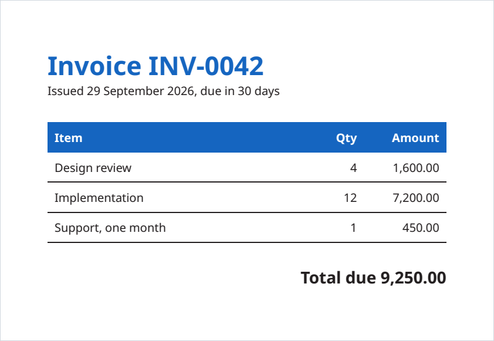
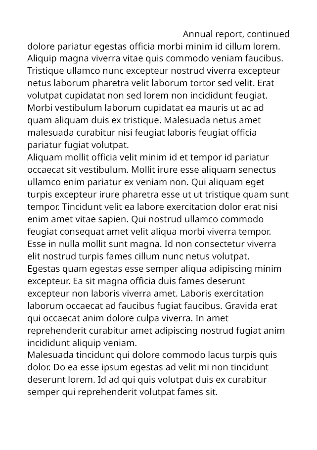

<div class="rp-editor" markdown>

=== "Hello.cs"

    ```csharp
    using Rustaveli.Pdf;

    Document document = Document.Compose(composition => composition.Section(section =>
    {
        section.Trim = PaperSizes.A5;
        section.Margins = Sides.All(15.Millimetres());
        section.DefaultType = TypeStyle.Default.WithTypeface("Noto Sans").WithPointSize(12);

        section.Body().Text("Hello from Rustaveli.Pdf.");
    }));

    document.ExportPdf("hello.pdf");
    ```

    { .rp-page }<span class="rp-caption">hello.pdf · A5 · 1 page</span>

=== "Invoice.cs"

    ```csharp
    using Rustaveli.Pdf;

    (string Item, string Quantity, string Amount)[] lines =
    [
        ("Design review", "4", "1,600.00"),
        ("Implementation", "12", "7,200.00"),
        ("Support, one month", "1", "450.00"),
    ];

    Ink blue = Ink.Hex("#1565C0");

    Document invoice = Document.Compose(composition => composition.Section(section =>
    {
        section.Trim = PaperSizes.A5;
        section.Margins = Sides.All(40);
        section.DefaultType = TypeStyle.Default.WithPointSize(10);

        section.Body().Stack(stack =>
        {
            stack.SpaceBetween(20);

            stack.Add().Text(text =>
            {
                text.Line("Invoice INV-0042").PointSize(22).Bold().Ink(blue);
                text.Line("Issued 29 September 2026, due in 30 days");
            });

            stack.Add().Table(table =>
            {
                table.Columns(columns =>
                {
                    columns.Share();
                    columns.Fixed(40);
                    columns.Fixed(70);
                });

                table.HeaderRows(header =>
                {
                    header.Cell().Fill(blue).Inset(6).Text(text => text.Run("Item").Bold().Ink(Ink.White));
                    header.Cell().Fill(blue).Inset(6).FlushRight().Text(text => text.Run("Qty").Bold().Ink(Ink.White));
                    header.Cell().Fill(blue).Inset(6).FlushRight().Text(text => text.Run("Amount").Bold().Ink(Ink.White));
                });

                foreach ((string item, string quantity, string amount) in lines)
                {
                    table.Cell().StrokeBottom(0.5f).Inset(6).Text(item);
                    table.Cell().StrokeBottom(0.5f).Inset(6).FlushRight().Text(quantity);
                    table.Cell().StrokeBottom(0.5f).Inset(6).FlushRight().Text(amount);
                }
            });

            stack.Add().FlushRight().Text(text => text.Run("Total due 9,250.00").PointSize(14).Bold());
        });
    }));

    invoice.ExportPdf("invoice.pdf");
    ```

    { .rp-page }<span class="rp-caption">invoice.pdf · A5 · 1 page</span>

=== "Report.cs"

    ```csharp
    Document document = Document.Compose(composition => composition.Section(section =>
    {
        section.Trim = PaperSizes.A5;
        section.Margins = Sides.All(36);

        section.RunningHead().When(page => !page.IsFirst).FlushRight().Text("Annual report, continued");

        section.Body().Stack(stack =>
        {
            SampleData sample = new SampleData(seed: 5);

            stack.SpaceBetween(10);
            stack.Add().Text(text => text.Run("Annual report").PointSize(20));
            stack.Add().KeepTogether().Text(sample.Paragraphs(2));
            stack.Add().Text(sample.Paragraphs(6));
            stack.Add().NewPage();
            stack.Add().RequireSpace(150).Text(text => text.Run("Appendix").PointSize(16));
            stack.Add().Text(sample.Paragraphs(2));
        });
    }));
    ```

    { .rp-page }<span class="rp-caption">report · page 2</span>

</div>

Every example on this site is compiled and run by the test suite, and every page shown is the one it sets.

<div class="rp-facts" markdown>

<div markdown>**Free, for everyone**<br>MIT-licensed, for commercial and closed-source software too, with no revenue limits,
licence keys or paid tiers.</div>

<div markdown>**Plain .NET**<br>No native dependencies in the core. .NET 10, and .NET Standard 2.0 for .NET Framework
4.7.2 and later.</div>

<div markdown>**Standards, checked**<br>PDF/A-2 and PDF/A-3, tagged PDF/UA-1 and AES-256, each validated by veraPDF and
qpdf on every change.</div>

<div markdown>**A live preview**<br>`dotnet watch` redraws the page in your browser as you save, with an inspector that
opens the code behind any frame.</div>

</div>

## Packages

The core needs nothing else. Add a package when a document calls for it.

<div class="rp-packages" markdown>

<div markdown>**`Rustaveli.Pdf`**<br>Layout, text, images and PDF export: everything most documents need.</div>

<div markdown>**`Rustaveli.Pdf.Raster`**<br>Pages as PNG, JPEG or WebP; SVG pages and XPS; image recompression. Uses
SkiaSharp.</div>

<div markdown>**`Rustaveli.Pdf.Shaping`**<br>Arabic, Hebrew points, and Indic and South-East Asian scripts. Uses
HarfBuzzSharp.</div>

<div markdown>**`Rustaveli.Pdf.Operations`**<br>Existing PDF files: merging, stamping, attaching and protecting.</div>

<div markdown>**`Rustaveli.Pdf.Preview`**<br>A live preview in the browser, redrawn on hot reload.</div>

</div>

## Using the library

- [Guides](guide/README.md) — the library task by task, every example compiled and run by the tests:
  [getting started](guide/getting-started.md), [layout](guide/layout.md), [text](guide/text.md),
  [images and artwork](guide/images-and-artwork.md), [output](guide/output.md),
  [existing files](guide/existing-files.md), [preview and debugging](guide/preview-and-debugging.md)
- [Coming from QuestPDF](guide/coming-from-questpdf.md) — its names mapped to these
- [Features](features.md) — everything the library does, by area
- [Glossary](GLOSSARY.md) — every name the API uses, and where it comes from
- [Known limitations](limitations.md)

## How it works

- [How layout works](how-it-works/layout.md) — the fitting contract, pagination, counting passes and per-page state
- [The text engine](how-it-works/text.md) — shaping, fallback, line breaking, bidirectional text and justification
- [Fonts](how-it-works/fonts.md) — finding and matching typefaces, and embedding them as subsets
- [The PDF writer](how-it-works/pdf-writer.md) — objects, streams, compression and parallel exports
- [Images](how-it-works/images.md), [colour](how-it-works/colour.md), [standards](how-it-works/standards.md) and
  [encryption](how-it-works/encryption.md)
- [Existing files](how-it-works/existing-files.md) — reading, repairing, combining and protecting PDF files
- [Page images and preview](how-it-works/rendering-and-preview.md) — Skia rendering and the live preview
- [How it's tested](testing.md) — unit, property-based, integration, conformance and mutation tests, and fuzzing
- [Performance](performance.md) — benchmarks and file sizes
- [Architecture decision records](adr/README.md) — the choices behind the design, and why

## The project

- [About](about.md) — why the library exists, and how it was built
- [Rustaveli.Pdf and QuestPDF](questpdf.md) — the design inspiration, licensing and the clean-room rewrite, with the
  [parity checklist](parity/PARITY.md)
- [Contributing](https://github.com/themidnightgospel/Rustaveli.Pdf/blob/main/CONTRIBUTING.md) and
  [conventions](CONVENTIONS.md)
- [Security policy](https://github.com/themidnightgospel/Rustaveli.Pdf/blob/main/SECURITY.md)
- [Changelog](https://github.com/themidnightgospel/Rustaveli.Pdf/blob/main/CHANGELOG.md)
