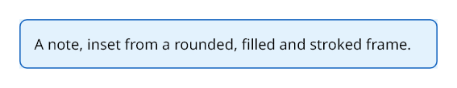

# Getting started

## Packages

| Package | Adds | Depends on |
|---|---|---|
| `Rustaveli.Pdf` | Layout, text, images, PDF export — everything most documents need | nothing |
| `Rustaveli.Pdf.Raster` | Pages as PNG, JPEG or WebP; image recompression for PDF export | SkiaSharp |
| `Rustaveli.Pdf.Shaping` | Arabic, Hebrew points, Indic and South-East Asian scripts | HarfBuzzSharp |
| `Rustaveli.Pdf.Operations` | Working with existing PDF files: merging, stamping, attaching, protecting | nothing |
| `Rustaveli.Pdf.Preview` | A live preview in the browser, redrawn on hot reload | `Rustaveli.Pdf.Raster` |

```
dotnet add package Rustaveli.Pdf
```

Every package targets .NET 10 and .NET Standard 2.0, so it runs on .NET Framework 4.7.2 and later too. Everything
public is in the `Rustaveli.Pdf` namespace.

## A first document

```csharp
using Rustaveli.Pdf;

Document document = Document.Compose(composition => composition.Section(section =>
{
    section.Trim = PaperSizes.A5;
    section.Margins = Sides.All(15.Millimetres());
    section.DefaultType = TypeStyle.Default.WithTypeface("Noto Sans").WithPointSize(12);

    section.Body().Text("Hello from Rustaveli.Pdf.");
}));

document.ExportPdf("hello.pdf");
```

{ .rp-output data-caption="hello.pdf" }

A document is composed of **sections**. A section is a run of pages sharing one page setup: its `Trim` (the page
size), its `Margins`, the `DefaultType` its text is set in, and the frames every page is made of:

| Frame | What goes there |
|---|---|
| `RunningHead()` | Repeated at the top of every page |
| `Body()` | The main content, flowing on to as many pages as it needs |
| `RunningFoot()` | Repeated at the bottom of every page |
| `Underlay()`, `Overlay()` | Drawn beneath or above everything, ignoring the margins — watermarks, page furniture |

Lengths are in points, 72 to the inch; `Millimetres()`, `Centimetres()`, `Inches()` and `Picas()` convert.

## Frames

Everything is set into a **frame**. A frame takes any number of modifiers — each wraps it and hands back the frame
inside — and then exactly one piece of content, which ends the chain:

```csharp
Document document = Document.Compose(composition => composition.Section(section =>
{
    section.Trim = PaperSizes.A5;
    section.Margins = Sides.All(40);

    section.Body().Stack(stack =>
    {
        stack.Add()
            .Stroke(1)
            .StrokeInk(Ink.Hex("#1565C0"))
            .RoundCorners(6)
            .Fill(Ink.Hex("#E3F2FD"))
            .Inset(12)
            .Text("A note, inset from a rounded, filled and stroked frame.");
    });
}));
```

{ .rp-output data-caption="page 1" }

Order matters as it would with real frames: the fill above is inside the stroke, and the inset inside the fill.
Content that holds several frames — a `Stack`, `Columns`, a `Table` — hands out a new frame for each, and so on
down. A frame fills the room it is given: the body is the whole text area, but an item of a stack is only as tall
as its content, so the note above is too. [Layout](layout.md) covers all of them.

## Reusing parts of a document

A piece of layout used more than once is a **snippet**: a class that composes into the frame it is given.

```csharp
public sealed class AddressBlock(string name, params string[] lines) : ISnippet
{
    public void Compose(IFrame frame) => frame.Text(text =>
    {
        text.Line(name).Bold();

        foreach (string line in lines)
            text.Line(line);
    });
}
```

```csharp
Document letter = Document.Compose(composition => composition.Section(section =>
{
    section.Trim = PaperSizes.A4;
    section.Margins = Sides.All(25.Millimetres());

    section.Body().Stack(stack =>
    {
        stack.SpaceBetween(24);
        stack.Add().Snippet(new AddressBlock("Tamar Beridze", "12 Rustaveli Avenue", "Tbilisi 0108"));
        stack.Add().Text("Dear Tamar,");
    });
}));
```

{ .rp-output data-caption="page 1" }

## Exporting

```csharp
byte[] bytes = document.ExportPdf();

using (FileStream stream = File.Create("to-a-stream.pdf"))
    document.ExportPdf(stream);

document.ExportPdf("to-a-file.pdf");
```

`ExportPdfAndOpen()` writes a temporary file and opens it in the system's viewer, for a quick look while writing.
The document's title, author and the rest go in `Document.Info`:

```csharp
document.Info.Title = "Hello";
document.Info.Author = "Rustaveli.Pdf";
document.Info.Language = "en";
```

Each export lays the document out afresh, so one document can be exported as often as needed, in any format, and
from any number of threads at once: an export that begins while another is under way runs the composing code again
for a copy of its own, so keep that code free of side effects.

[Output](output.md) covers the options: typefaces, image quality, PDF/A, PDF/UA, protection, and page images.

## Next

- [Layout](layout.md): stacks, columns, tables, lists, and how content flows across pages
- [Text](text.md): paragraphs, type styles, typefaces and style sheets
- [Preview and debugging](preview-and-debugging.md): see the document as you write it
