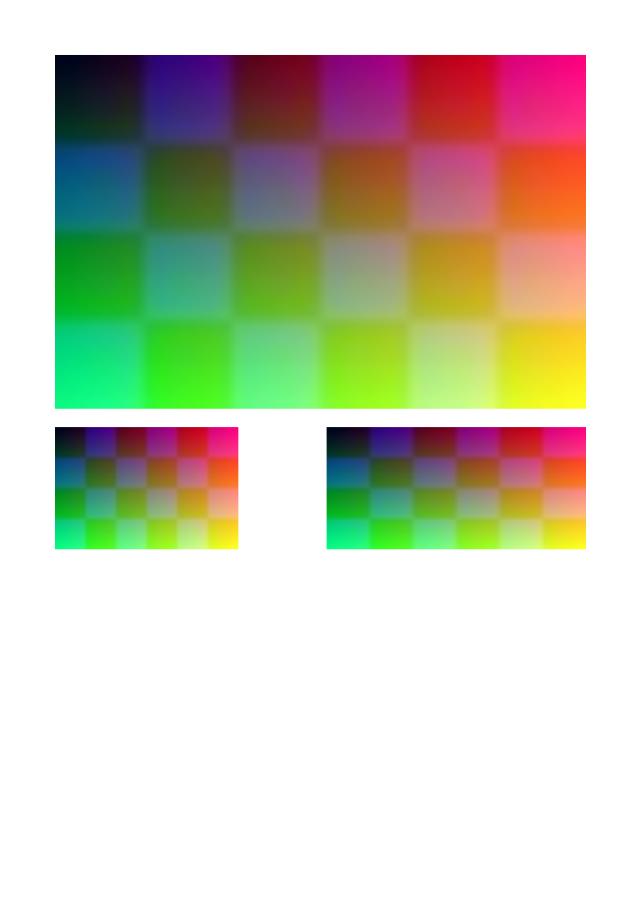
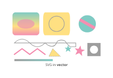

# Images and artwork

**Images** are pixels — photographs, scans, screenshots. **Artwork** is vector — logos, diagrams, charts — and
stays vector in the PDF, sharp at any size.

## Images

```csharp
RasterImage photo = RasterImage.FromFile("photo.jpg");

Document document = Document.Compose(composition => composition.Section(section =>
{
    section.Trim = PaperSizes.A5;
    section.Margins = Sides.All(36);

    section.Body().Stack(stack =>
    {
        stack.SpaceBetween(12);
        stack.Add().Image(photo);
        stack.Add().Columns(columns =>
        {
            columns.Gutter(8);
            columns.Share().Height(80).Image(photo, ImageFitting.Proportionally);
            columns.Share().Height(80).Image(photo, ImageFitting.Stretch);
        });
    });
}));
```

{ .rp-output data-caption="page 1" }

JPEG and PNG files — greyscale, RGB, CMYK, palettes, transparency, sixteen bits, ICC profiles — are embedded as they
were encoded wherever PDF can carry them, so nothing is lost and nothing is recompressed. JPEGs are turned the right
way up by their EXIF orientation. An image placed many times is embedded once.

| `ImageFitting` | The image… |
|---|---|
| `FitWidth` (default) | Takes the frame's width, its height following in proportion |
| `FitHeight` | Takes the frame's height, its width following in proportion |
| `Proportionally` | Is as large as fits the frame, in proportion |
| `Stretch` | Fills the frame, in or out of proportion |

### Size and quality

Large photographs shown small can be scaled down to the resolution they are shown at, and recompressed, when they
are embedded. Both need an image processor; the `Rustaveli.Pdf.Raster` package has one:

```csharp
byte[] pdf = document.ExportPdf(new PdfExportOptions
{
    MaximumImageResolution = 150,
    ImageQuality = 80,
    ImageProcessor = SkiaImageProcessor.Instance,
});
```

The options apply to every image; `photo.WithMaximumResolution(300).WithQuality(90)` sets them for one.

## Artwork from SVG

```csharp
Artwork logo = Artwork.FromSvgFile("logo.svg");

section.Body().Width(120).Artwork(logo);
```

{ .rp-output data-caption="page 1" }

What drawing tools write is read: shapes and paths, fills and strokes with their dashes, transforms, clip paths,
linear gradients, text, embedded images, `use` and `viewBox`, and styles given as attributes, `style` or style
sheets. The artwork is drawn as PDF paths, not as a picture of them. Radial gradients are drawn in the mean of their
colours; filters, masks, patterns and markers are left out.

## Drawing artwork

`Artwork.Draw` makes artwork of a given size from paths, text and images:

```csharp
Artwork badge = Artwork.Draw(120, 40, draw =>
{
    VectorPath outline = new VectorPath().AddRoundedRectangle(0, 0, 120, 40, Corners.All(20));
    draw.Fill(outline, Gradient.Across(Ink.Hex("#1E88E5"), Ink.Hex("#8E24AA")));
    draw.Stroke(outline, Ink.Hex("#0D47A1"), new LineStyle(1.5f));
    draw.Text("Approved", 60, 25, TypeStyle.Default.WithPointSize(14).Bold().WithInk(Ink.White), TextAnchor.Middle);
});

section.Body().Width(120).Artwork(badge);
```

{ .rp-output data-caption="page 1" }

Coordinates run from the top left, in points. `VectorPath` builds shapes from lines, Bézier curves and arcs;
`SaveState`, `Translate`, `Scale`, `Rotate` and `Clip` work as in any vector drawing API.

## Made for their box

Artwork or an image can be made when layout knows the box it will fill — a chart drawn to the exact size of its
frame, say:

```csharp
section.Body().Height(160).Artwork(size => Artwork.FromSvg(FormattableString.Invariant(
    $"""
    <svg xmlns="http://www.w3.org/2000/svg" width="{size.Width}" height="{size.Height}">
      <rect x="0" y="{size.Height * 0.4}" width="{size.Width / 3}" height="{size.Height * 0.6}" fill="#43A047"/>
      <rect x="{size.Width / 3}" y="{size.Height * 0.1}" width="{size.Width / 3}" height="{size.Height * 0.9}" fill="#1E88E5"/>
      <rect x="{size.Width * 2 / 3}" y="{size.Height * 0.7}" width="{size.Width / 3}" height="{size.Height * 0.3}" fill="#FB8C00"/>
    </svg>
    """)));
```

{ .rp-output data-caption="page 1" }

Numbers written into SVG take a decimal point whatever the culture the program runs in, so the text is formatted
with `FormattableString.Invariant`: in a culture that writes a decimal comma, `123,45` is no length SVG can read.

`Image(request => ...)` does the same for pixels: it is asked for an image of `request.PixelWidth` by
`request.PixelHeight`, at the export's `ImageResolution`, and returns the encoded bytes.

## Placeholders

While a document is being designed, `Placeholder("Photo")` stands in for an image not there yet, and `SampleData`
provides stand-in words, names, numbers, dates and images — the same every time for the same seed.
