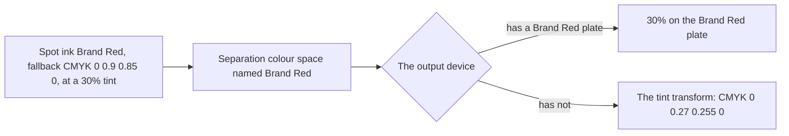

# Colour

Colour in Rustaveli.Pdf is an
[`Ink`](https://themidnightgospel.github.io/Rustaveli.Pdf/api/reference/Rustaveli.Pdf.Ink.html): a colour as print
thinks of it, rather than as a screen does. The decision and its reasons are recorded in
[ADR 0004](../adr/0004-ink-colour-model.md); this page explains what an ink is, how each kind is written into the
PDF, and what happens to it on the way.

## Three kinds of ink

| `InkModel` | Made with | What it is |
|---|---|---|
| `Rgb` | `Ink.Rgb(30, 136, 229)`, `Ink.Hex("#1E88E5")` | Red, green and blue light, as a screen shows colour |
| `Cmyk` | `Ink.Cmyk(0, 0.4, 1, 0)` | Cyan, magenta, yellow and black process inks, as a press lays them down, each from 0 to 1 |
| `Spot` | `Ink.Spot("Brand Red", Ink.Cmyk(0, 0.9, 0.85, 0))` | A named ink mixed in advance and printed on a plate of its own, with a process colour to fall back on |

Every ink also has a **tint** — how much of the ink is laid down — and an **opacity** — how much of what lies beneath
shows through. The two are different things, and are written differently, as the sections below explain.

Four inks are named: `Ink.Black`, `Ink.White`, `Ink.Transparent` and `Ink.Registration`. `Black` is process black
alone — CMYK 0, 0, 0, 1 — and is the default ink of text, rules and strokes, so black text prints on the black plate
alone, as a printer expects. `White` is no ink at all: the paper shows. `Registration` is a spot ink named `All`, which PDF defines as the ink that prints on every
separation, for crop and registration marks.

## How an ink reaches the page

The PDF surface writes each ink in its own colour space, with the operators PDF provides for it:

| Ink | Written as | Fill and stroke operators |
|---|---|---|
| RGB | `DeviceRGB` | `rg`, `RG` |
| CMYK | `DeviceCMYK` | `k`, `K` |
| Spot | A `Separation` colour space, and the tint | `cs` and `sc`, `CS` and `SC` |

Outside gradients and PDF/A, both described below, an ink is written in the model it was given: a CMYK ink is not
converted to RGB, nor an RGB one to CMYK. The surface remembers the colour and opacity in force, across saved and restored graphics states
as the PDF viewer does, and writes them again only when they change.

## Spot inks and separations

A spot ink is written as a `Separation` colour space — PDF's name for an ink with a plate of its own. The colour space
names the ink, and gives a *tint transform*: a function from the tint to the process fallback, so that a device that
has no plate for the ink can still show something close.



For the ink above, the colour space written is:

```text
[/Separation /Brand#20Red /DeviceCMYK
  << /FunctionType 2 /Domain [0 1] /C0 [0 0 0 0] /C1 [0 0.9 0.85 0] /N 1 >>]
```

`C0` is no ink and `C1` the fallback at full strength; the reader interpolates between them. A fallback given in
RGB gives an RGB tint transform instead, whose `C0` is white. Each distinct ink — the same name and fallback — is
written once and shared by every page that uses it, and the content stream selects it and sets the tint:
`/CS0 cs 0.3 sc`.

The name is what matters to a print shop: separations are made by ink name, so the name should be exactly what the
printer calls the ink. The fallback matters to everything else — screens, office printers, and the conversions
described below.

## Tints

A tint is a percentage of an ink, as a press lays down less of it. `Tint(amount)` takes a fraction from 0, bare
paper, to 1, the ink itself, and means the same thing on paper for each kind of ink:

- **CMYK** — every component is scaled: `Ink.Cmyk(0, 0.8, 1, 0).Tint(0.5)` is CMYK 0, 0.4, 0.5, 0.
- **Spot** — the tint is recorded as the tint the plate prints at, and written as the operand of `sc`. The ink's
  name and fallback are untouched, so a 30% tint still prints on the ink's own plate.
- **RGB** — each component moves toward white paper: a component *c* becomes *c* + (1 − *amount*)(1 − *c*). There is
  no plate to lay less ink on, so the tint is the colour a thinner layer would show.

Tints compose: a tint of a tint multiplies the amounts.

## Opacity

Opacity is not part of any PDF colour space. It is a property of the graphics state, so the surface writes an
`ExtGState` dictionary giving constant opacity for fills (`/ca`) and for strokes (`/CA`), and selects it with `gs`.
One such dictionary is written for each distinct pair of opacities in the document, and reused wherever that pair
is needed again.

An ink's opacity comes from `WithOpacity`, or from the alpha channel of `Ink.Hex("#801E88E5")`, which gives an
opacity of 128/255. An ink whose opacity is 0 draws nothing at all, and no operator is written for it.

Some drawing needs more than a constant opacity. PDF has no blur, so a blurred drop shadow is drawn as an image: a
single pixel of the shadow's ink, stretched over the shadow's area and seen through a soft mask of its blurred
coverage. Identical shadows — those of every cell in a table, say — share one image.

## Gradients

A [`Gradient`](https://themidnightgospel.github.io/Rustaveli.Pdf/api/reference/Rustaveli.Pdf.Gradient.html) blends
two or more inks along a line. At 0 degrees it runs from left to right, and the angle turns it clockwise, so 90 runs
from top to bottom. As in CSS, the line runs through the centre of the box and is long enough that the corners take
the first and last inks exactly, whatever the angle. `GradientStop`s place inks at positions along the line;
otherwise they are spaced evenly.

A gradient is written as a *shading pattern*: an axial shading between the two ends of the line, extended beyond
both so that the box is covered, and painted by a function of the inks. Two inks at the ends are one interpolation;
more are several, stitched together at the stops' positions, with the first and last inks held before and after
their stops. The pattern is placed with the drawing transformation in force when it is set, so a gradient in a
rotated or scaled frame turns and scales with it.

The blend's colour space follows its inks:

| The gradient's inks | Blended in |
|---|---|
| All CMYK | `DeviceCMYK` |
| Any other mix — RGB, spot, or RGB with CMYK | `DeviceRGB`, each ink converted to RGB and spot inks showing their fallback |

A spot ink in a gradient therefore does not print on its own plate: gradients are never blended in a `Separation`
colour space, and one that involves a spot ink blends its fallback. Keep spot inks to flat fills and text where the
separation matters.

All the inks of a gradient must share one opacity — the constructor refuses others — because opacity is applied to
the whole blend at once through the graphics state. Varying opacity along a blend would need a soft mask for every
gradient. SVG gradients whose stops differ in opacity are drawn at the mean of their opacities.

## Conversions between models

`ToRgb` and `ToCmyk` convert an ink when another model is needed, without a colour profile:

- **CMYK to RGB** — each of red, green and blue is (1 − its complementary ink) × (1 − black).
- **RGB to CMYK** — black is generated from the darkest channel, as 1 − max(red, green, blue), and cyan, magenta and
  yellow make up the rest.
- **Spot** — the fallback is converted, then tinted.

These are the textbook conversions. They are not colour-managed, and a printer's own separation of the same colour,
through the profile of its press and paper, can differ. They are used where a model has no choice: in a gradient
that mixes models, in PDF/A output, and wherever the library draws for a screen — page images, SVG and XPS from the
`Rustaveli.Pdf.Raster` package show every ink by its RGB value (see
[Rendering and preview](rendering-and-preview.md)).

## Why there is no built-in palette

The library once shipped the Material Design palette of RGB colours. It was removed when colour became `Ink`
([ADR 0004](../adr/0004-ink-colour-model.md)), and documents now bring their own colours. A palette fits a model in
which every colour is RGB; once a colour may equally be a CMYK mix or a named ink on its own plate, which of those a
brand's red is belongs to the document, not to a list of screen colours in the library. The inks that remain named —
black, white, registration and transparent — are the ones whose meaning does not depend on the document.
Coming from a library with a palette, write the colour out: `Colors.Blue.Medium` becomes `Ink.Hex("#2196F3")`.

## Colour in PDF/A

PDF/A requires that every colour a file uses be defined, not left to the device showing it. Device colours — plain
RGB, CMYK and grey — are allowed only when the file's *output intent* says what they mean. A PDF/A file from this
library declares one output intent, sRGB, with an ICC profile of sRGB built by the library itself, and so writes
every colour in terms of it:

| In a plain PDF | In PDF/A |
|---|---|
| RGB inks in `DeviceRGB` | Unchanged |
| CMYK inks in `DeviceCMYK` | Converted to RGB by `ToRgb` |
| Spot inks as `Separation` spaces | Converted to RGB: the fallback at the ink's tint; no separation is written |
| Gradients in CMYK where all their inks are | Always in RGB |
| Shadows in CMYK for a CMYK ink, smoothed by the viewer | In RGB, and not smoothed, since PDF/A forbids asking a viewer to interpolate |
| CMYK images with no profile of their own | Converted to RGB, which needs an image processor (see [Images](images.md)) |
| Images with an ICC profile | Unchanged: the profile defines their colours |

Opacity is written the same way in both: parts 2 and 3 of PDF/A, unlike part 1, allow transparency.

The consequence is that a PDF/A file from this library is an RGB document. That suits archiving, which is about
showing the same colours wherever and whenever the file is opened, but not print production that needs separations
or a press's CMYK: for that, export plain PDF. More on what PDF/A requires is in [Standards](standards.md).
