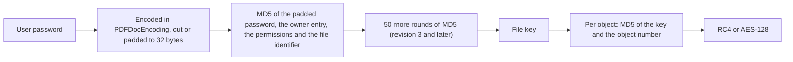
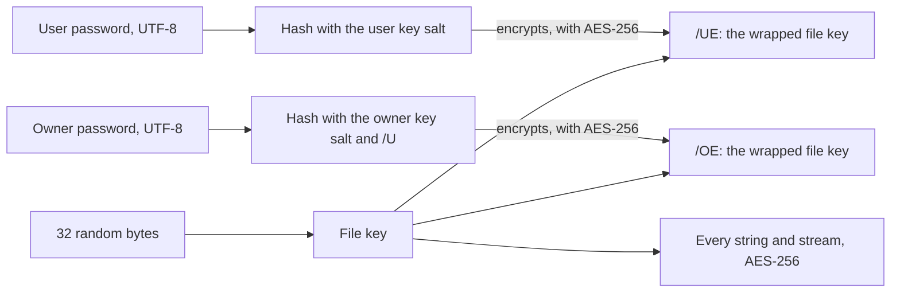

# Encryption

A PDF can be protected by password: encrypted so that it opens only with a password, and carrying restrictions on
what a reader may do once it is open. Rustaveli.Pdf writes and reads PDF's *standard security handler* — the
password-based one every reader supports — in the managed writer for new documents and in `Rustaveli.Pdf.Operations`
for existing files. This page explains how the encryption works, what it covers, and what it does and does not
protect. How to ask for it is in the guide, [Output](../guide/output.md#protection), and for existing files,
[Existing files](../guide/existing-files.md#protection-and-web-viewing).

## Four strengths

[`Protection`](https://themidnightgospel.github.io/Rustaveli.Pdf/api/reference/Rustaveli.Pdf.Protection.html) takes
an [`EncryptionLevel`](https://themidnightgospel.github.io/Rustaveli.Pdf/api/reference/Rustaveli.Pdf.EncryptionLevel.html),
AES with 256-bit keys unless another is named:

| `EncryptionLevel` | Cipher | Key | Handler version and revision | Since |
|---|---|---|---|---|
| `Rc4With40Bits` | RC4 | 40 bits | V 1, R 2 | PDF 1.1 |
| `Rc4With128Bits` | RC4 | 128 bits | V 2, R 3 | PDF 1.4 |
| `AesWith128Bits` | AES, CBC mode | 128 bits | V 4, R 4 | PDF 1.6 |
| `AesWith256Bits` (default) | AES, CBC mode | 256 bits | V 5, R 6 | PDF 2.0 |

The RC4 levels are there for old readers. RC4 with a 40-bit key can be broken by anyone who tries; only AES with
256-bit keys is still considered strong. Reading, the library also opens revision 5 — an interim 256-bit revision
that revision 6 replaced — and files whose crypt filters name the identity filter. A file encrypted by a handler other
than the standard one, such as certificate-based encryption, is refused.

## Two passwords

A protected file has two passwords, with different jobs:

- The **user password** opens the file, with the restrictions it carries. Empty — the default — opens it without
  asking, so the file opens for everyone but still carries its restrictions.
- The **owner password** opens the file with every restriction lifted. When none is given, the library makes one up
  from 24 random bytes and forgets it, so the restrictions cannot be lifted by anyone.

The restrictions are the file's *permissions*, a set of bits in the encryption dictionary's `/P` entry:

| `Protection` property | Permission bit | Allows |
|---|---|---|
| `AllowPrinting` | 3 | Printing |
| `AllowModifying` | 4 | Changing the document |
| `AllowCopying` | 5 | Copying text and images out |
| `AllowAnnotating` | 6 | Adding comments and filling in form fields |
| `AllowFillingForms` | 9 | Filling in form fields even where annotating is not allowed |
| `AllowAccessibility` | 10 | Assistive technology reading the content, even where copying is not allowed |
| `AllowAssembling` | 11 | Inserting, rotating and removing pages; making bookmarks and thumbnails |
| `AllowHighQualityPrinting` | 12 | Printing faithfully, rather than at a reader's low-resolution fallback |

Everything is allowed unless turned off. The bits the standard reserves are set as it requires. For a document meant
to be accessible, leave `AllowAccessibility` on.

## From password to key

Every string and stream in the file is encrypted with one *file key*, or with keys made from it. The password never
encrypts anything itself: it is the way to the file key, and the encryption dictionary holds what a reader needs to
check a password and recover the key from it. The two families of revisions do this very differently.

### Revisions 2 to 4: RC4 and 128-bit AES

The file key is derived from the user password, not chosen. The password is encoded in PDFDocEncoding and cut or
padded to 32 bytes with a fixed padding the standard defines; MD5 is taken of it together with the owner entry, the
permissions and the first half of the file's identifier, and at revision 3 and later hashed fifty times more. At
revision 4, a file that leaves its metadata unencrypted mixes that into the key too.

The encryption dictionary then carries two entries that let a reader check passwords:

- The **owner entry**, `/O`: the padded user password, encrypted with RC4 under a key made from the owner password.
  The owner password therefore unlocks the user password, and through it the file key.
- The **user entry**, `/U`: a known value — the padding, or at revision 3 and later a hash of it with the file
  identifier — encrypted under the file key. A reader derives a key from the password it is given, encrypts the same
  value, and compares.

Each object is then encrypted with its own key: MD5 of the file key and the object's number (with a fixed suffix
for AES), cut to at most 16 bytes. Two consequences follow for passwords at these levels. Only the first 32
characters count. And a character PDFDocEncoding cannot represent is written as `?` — so at these levels a password
in Georgian or Japanese is, in effect, a string of question marks of the same length. Use AES with 256-bit keys for
passwords outside PDFDocEncoding's Latin repertoire.

### Revision 6: 256-bit AES

At revision 6 the file key is 32 random bytes, not derived from anything. The passwords are taken as UTF-8, up to 127
bytes, and each is used twice with its own random salts:

- Hashed with a *validation salt*, it gives the value stored in `/U` or `/O`, against which a password is checked.
- Hashed with a *key salt*, it gives a key that encrypts the file key; the results are stored in `/UE` and `/OE`.
  Either password unwraps the same file key.

The hash is the standard's iterated algorithm: SHA-256 of the password and salt, then at least 64 rounds that encrypt
the password and the running hash with AES-128 and hash the result with SHA-256, SHA-384 or SHA-512, chosen by the
data itself. The owner's hash also takes in the user entry, tying the two together. The permissions are stored a
second time in `/Perms`, encrypted with the file key, so that a reader can tell whether `/P` has been changed.

At revision 6 every object is encrypted with the file key itself; there is no per-object key.

### Opening a protected file

[`PdfFile.Open`](https://themidnightgospel.github.io/Rustaveli.Pdf/api/reference/Rustaveli.Pdf.PdfFile.html) takes a
password and tries it both ways: as the user password, and as the owner password recovering the user's. Either opens
the file. With no password it tries the empty one, which opens a file whose user password is empty. Anything else
fails with an
[`IncorrectPasswordException`](https://themidnightgospel.github.io/Rustaveli.Pdf/api/reference/Rustaveli.Pdf.IncorrectPasswordException.html).
A file saved without `Protect` or `Unprotect` keeps the protection it had.

## What is encrypted

The standard encrypts **strings** and **streams**; names, numbers and the shape of the objects are not encrypted.
The library writes:

- **Streams** — page content, fonts, images — compressed first and encrypted after, since encrypted data does not
  compress.
- **Strings**, each encrypted for the object it is in and written in hexadecimal.
- **Object streams**, which is where the writer packs most objects that are not themselves streams. They are
  streams, so are encrypted as a whole, and the objects inside them with them.

Under AES, every string and stream gets its own random 16-byte initialisation vector, written in front of it, and is
padded to the cipher's block size.

A few things stay in the clear, as the standard requires or allows:

| Left unencrypted | Why |
|---|---|
| The encryption dictionary | A reader needs it to decrypt everything else |
| The cross-reference stream | A reader needs it to find the objects |
| The XMP metadata, when `EncryptMetadata` is off | So that search engines and archives can read it without the password; the RC4 levels always encrypt it |

Every run is different. An unprotected export identifies itself by a hash of its content, so the same document gives
the same bytes every time; a protected one needs a fresh random identifier — the older revisions build it into the
key — and AES adds random keys, salts and initialisation vectors. Two protected exports of one document do not match
byte for byte, though they open to the same pages.

## Protection and PDF/A

PDF/A forbids encryption: an archived file must open without anything from outside it, a password included. Asking
`ExportPdf` for both `Protection` and a PDF/A `Conformance` fails at once with an `InvalidOperationException`, rather
than write a file that claims PDF/A and cannot be one. `PdfFile.Protect` makes no such check on an existing file; an
encrypted file is not PDF/A, whatever its metadata claims, so leave archival files unprotected. See
[Standards](standards.md).

## What protection does and does not do

!!! note "Restrictions are a request, not a lock"
    Anyone who can open a file can read it. Permissions are honoured by well-behaved readers, not enforced by the
    encryption: the key that decrypts the file for viewing decrypts it for everything else. Only a user password
    keeps a file closed.

With a **user password**, a file encrypted with AES-256 cannot be read without the password — as strong as the
password is. That is the protection encryption gives: confidentiality against someone who has the file but not
the password.

With an **empty user password**, the file opens for everyone, and so does its key: the encryption only carries the
restrictions. It deters casual copying or printing in readers that respect the permissions; it stops nothing else.
The library itself shows how little restrictions hold against a program that does not honour them: a file opened
with its user password by `PdfFile.Open(file, userPassword)` and saved after `Unprotect()` has no restrictions left.

Encryption also does not show who made a file or that it has not been changed since; that is what a digital
signature is for.

The implementation is checked against qpdf both ways at every strength: files this library protects open in qpdf
with either password and decode cleanly, with the permissions that were asked for, and are refused with a wrong one;
and files qpdf protects open here with either password, keep their protection when saved, and lose it cleanly when
unprotected. The project's
[security policy](https://github.com/themidnightgospel/Rustaveli.Pdf/blob/main/SECURITY.md) counts an encrypted
file readable without its password among the vulnerabilities to report.
