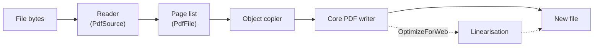
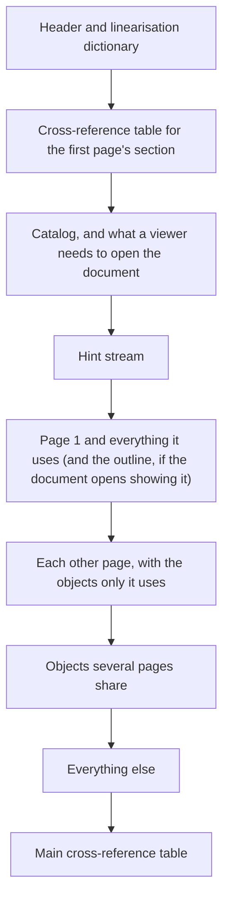

# Existing files

Much work with PDF starts from a file that already exists — often one this library did not write, and not always
written well — and cuts it down, joins it to others, stamps it, attaches an invoice's XML to it, protects it or
prepares it for the web. The `Rustaveli.Pdf.Operations` package does this work. This page explains how; the
[guide](../guide/existing-files.md) shows how to use it.

## A reader to match the writer

The package reads PDF in managed code, as the core writes it ([ADR 0001](../adr/0001-managed-pdf-writer.md)), so
operations run wherever the core runs, with no native library to install. The decision is recorded in
[ADR 0019](../adr/0019-operations-on-existing-files.md).

Everything goes through [`PdfFile`](https://themidnightgospel.github.io/Rustaveli.Pdf/api/reference/Rustaveli.Pdf.PdfFile.html).
Opening a file reads all of its bytes into memory; a stream is read to its end. Nothing is written until the file is
saved: until then, each operation changes only a list of pages, each still pointing into the file it came from,
and a few settings for the save.



## Reading a file

### Finding the objects

A PDF ends with the offset of its last cross-reference section, which lists where each object lies. The reader
looks for `startxref` in the file's last 4,096 bytes and follows the sections back through the `/Prev` entries
each update adds, reading tables and cross-reference streams alike. An object keeps the entry of the latest section
that mentions it, and an object a later update deleted stays deleted. Hybrid files, whose table leaves some objects
to a cross-reference stream that only newer readers follow, are read through both.

Objects are read only when asked for, and kept once read. An object kept inside an object stream is found by
decoding that stream once, the first time any of its objects is needed. Values are read into the core writer's own
types — a name keeps its bytes, a real number the text it was written as — so what is read can be written again
without conversion.

Each page is given the attributes it inherits from the page tree — resources, media box, crop box and rotation —
written into its own dictionary, so a page can later be moved on its own. A page with no media box anywhere above it
is taken to be US Letter, as viewers take it.

### Decoding streams only when needed

Streams stay as they were encoded unless an operation must read their content: object streams, cross-reference
streams, the pages drawn as stamps, and metadata being extended. The reader undoes Flate and LZW, with PNG and
TIFF predictors, ASCIIHex, ASCII85, run-length and the identity crypt filter. Image codecs — DCT, JPX, CCITT and
JBIG2 — are never decoded: pages keep their images byte for byte.

### Repairing what it can

Files are often damaged in small, predictable ways, which the reader repairs as viewers do:

| Damage | What the reader does |
|---|---|
| The cross-reference section is missing, cannot be parsed, or its trailer names no catalog | Rebuilds the list by scanning the whole file for objects |
| An object is not at the offset listed for it | Rebuilds by scanning, once; an object still not found reads as null |
| A stream's `/Length` is wrong | Ends the stream at its `endstream` keyword instead |
| Flate data is cut short | Keeps what inflated before the damage |
| The first table subsection is numbered from 1 though it begins with object 0 | Reads it from 0 |
| AES-encrypted data whose padding does not check out | Keeps the data whole rather than losing it |

Rebuilding scans for every `n g obj`, skipping text that only looks like one, and keeps the last object of each
number, as later objects replace earlier ones; objects in object streams are found through the streams it finds. The
trailer is put together from every `trailer` in the file, or else the catalog is found by its type.

Some damage cannot be repaired, and opening fails with
[`UnreadableFileException`](https://themidnightgospel.github.io/Rustaveli.Pdf/api/reference/Rustaveli.Pdf.UnreadableFileException.html):
no `%PDF-` header in the first kilobyte, no catalog anywhere, a catalog with no page tree, or a stream with no end.

## Protected files

A protected file is opened with the standard, password-based security handler at each of its strengths: RC4 with
40-bit and 128-bit keys and AES with 128-bit and 256-bit keys. The password given is tried as the user password,
then as the owner password. With no password the empty one is tried, so a file that only restricts what may be done
with it — with no user password — opens without one. A wrong or missing password raises
[`IncorrectPasswordException`](https://themidnightgospel.github.io/Rustaveli.Pdf/api/reference/Rustaveli.Pdf.IncorrectPasswordException.html);
a file encrypted by another security handler, such as one using certificates, is refused with
`NotSupportedException`.

Once the key is known, the objects read to find it are thrown away and read again, decrypted with each object's
own key. The encryption dictionary and cross-reference streams are never encrypted, objects inside an object stream
are decrypted with their stream, and metadata the file says is not encrypted is left as it is.

The library does not enforce the permissions a file sets: opened with either password, every operation is allowed.
[`WasProtected`](https://themidnightgospel.github.io/Rustaveli.Pdf/api/reference/Rustaveli.Pdf.PdfFile.html) says
whether the file was encrypted. How the ciphers and keys work is described in [Encryption](encryption.md).

## Saving writes a new file

A file is never updated in place. Saving writes a new one through the core writer, with object streams, a
cross-reference stream and compression, as a generated document is written ([The PDF writer](pdf-writer.md)): one
compact file with a single cross-reference section, whatever updates the original had accumulated.

Pages are copied by following references. Each object reached from a kept page is copied once, however often it is
reached, and renumbered. A stream is copied with its data exactly as it was encoded; a stream with no filter at all
is compressed as it is written, where that makes it smaller. Objects no kept page reaches — pages left out, objects
an earlier update replaced — are never written.

Following references blindly would pull in everything: an annotation points to its page, the page to the page
tree, and the tree to every other page. So some objects are *redirected* rather than copied:

- each kept page goes to the page it became;
- the old page tree and the old catalog go nowhere — a reference to them becomes null.

A link on page 3 whose destination is page 5 therefore still works if page 5 is kept, and points nowhere if it is
not. A page kept twice — `KeepPages("1, 1")` — is written as two page objects sharing one set of content and
resources; references to it lead to the first.

The copier knows an object by the file it came from and its number. Two files that embed the same font each bring
their own copy, and a file opened twice counts as two files.

`Save(path)` writes beside the target first and moves the finished file into place, so a file can be saved over the
file it was opened from, and a failure leaves that file as it was.

### What is kept, and what is dropped

Saving keeps what the first file says of the document as a whole, but only while that remains true. Parts that
point at pages — an outline, named destinations, a structure tree — would lead to nothing, or to the wrong page, once
pages are left out or moved. They are kept only while the first file is *whole*: all of its pages are there, in their
order, at the start. Appending to a file keeps it whole; `KeepPages("2, 1")` does not.

| Part | Kept |
|---|---|
| Every kept page, with its content, resources and annotations | Always |
| The first file's information dictionary, XMP metadata, language, output intents, viewer preferences, page layout, version and extensions | Always |
| The first file's attachments and associated files | Always |
| The first file's outline, named destinations and other name trees, structure tree, form fields, and the rest of its catalog | While it is whole |
| The link from each page into the structure tree | For the first file's pages, while it is whole |
| Anything document-wide in the other files — their outlines, attachments, information, metadata | Never |

Combining the outlines and structure trees of several files is left for later ([ADR 0019](../adr/0019-operations-on-existing-files.md)).
The pages of appended files keep their annotations, form widgets among them, but the document's form, when it is kept at
all, lists only the first file's fields.

!!! note
    A file's metadata is kept even when its structure is not, so a file that claims PDF/A level A or PDF/UA, cut
    down or reordered, still claims a standard that depends on the structure it has lost. A file saved unchanged,
    on the other hand, still meets its standards: the tests check this with veraPDF for files written as PDF/A-2a
    and PDF/UA-1.

## Stamps and letterheads

`Overlay` and `Underlay` record, for each target page, the pages to draw over it or beneath it; the layer's pages
are taken in turn and start again when they run out. Layers move with their page when pages are later reordered.

On saving, each layer page becomes a form XObject: its content streams, decoded and joined, its resources, and its
visible box — the crop box, or else the media box — as the form's bounds. The page's own content streams are left
untouched; new streams are put around them:

```text
q /Layer0 Do Q      the letterhead, beneath
q
  ... the page's own content streams, unchanged ...
Q
q /Layer1 Do Q      the stamp, over
```

The page's content runs inside a saved graphics state, so a transformation or colour it leaves behind cannot shift
or tint the stamp. The forms are named `Layer0`, `Layer1` and so on, skipping any name the page already uses.

A layer is drawn where it lies on its own page, not scaled or moved to fit the page beneath: a mark at (100, 700) on
the stamp's page lands at (100, 700) on the page it is laid over, and whatever lies outside the stamp's visible box
is clipped. Only the layer's content and resources are carried; its own annotations and rotation are not.

## Attachments and metadata

`Attach` writes each file as an embedded file stream, compressed, with its size, its modification date — the moment
of saving when none is given — an MD5 checksum, its media type and, if given, its creation date. A file
specification names it, describes it and records its relationship to the document. The specification is listed in
the document's `EmbeddedFiles` name tree, where readers find attachments, and in the catalog's associated files
(`/AF`), where PDF/A-3 reads the relationship. Two attachments of one name are listed apart, the second as
`name (2)`.

`AddMetadata` parses the file's XMP packet, adds each element it is given to the packet's `rdf:RDF`, and writes the
packet anew, uncompressed; a file with no metadata gets a new packet. It takes raw XMP because an electronic invoice
needs more than values: PDF/A requires a description of any schema it does not know, and the library cannot know
every standard's. Metadata that is not well-formed XML is refused. An invoice attached this way to a PDF/A-3 file
is checked with veraPDF in the tests, and stays PDF/A-3.

## Protection on saving

Unless told otherwise, a protected file is saved with the protection it had, with the same key. `Protect` replaces
it with a new [`Protection`](https://themidnightgospel.github.io/Rustaveli.Pdf/api/reference/Rustaveli.Pdf.Protection.html),
at any [`EncryptionLevel`](https://themidnightgospel.github.io/Rustaveli.Pdf/api/reference/Rustaveli.Pdf.EncryptionLevel.html),
and `Unprotect` saves without any. The writer encrypts each object as it writes it, as for a generated document.

`LiftRestrictions` leaves out the catalog's `/Perms`, the restrictions a signature places on changing the file.

## Fast web view

`OptimizeForWeb` linearises the file (ISO 32000-1, annex F), so that a viewer can show the first page before the
rest has downloaded. The file is first written plainly, then read back with the same reader and laid out anew:



What each page uses is found by following references from it, stopping at the page tree, the catalog and the
information dictionary. What a viewer needs to open the document is the catalog's viewer preferences, page mode,
article threads, open action and form. The hint stream tells a viewer where each page and each shared object lies;
since its own size moves what follows it, the file is laid out again, up to eight times, until the hint stream stops
changing.

Every object is written on its own, with classic cross-reference tables: a linearised file gives up the object
streams a plain save uses. A protected file is encrypted as it is laid out. The tests check files from every
specimen, plain and protected, with qpdf's linearisation check.

## Merging while composing, or combining files

[`Document.Merge`](https://themidnightgospel.github.io/Rustaveli.Pdf/api/reference/Rustaveli.Pdf.Document.html)
belongs to the core, not to this package, and works at another level: it joins documents *before* layout, into one
document that is exported once.

| | `Document.Merge` | `PdfFile.Append` |
|---|---|---|
| Works on | Documents composed with this library | Any PDF files |
| When | Before layout | After export |
| Page numbers | Run on from part to part, or restart with `NumberPartsSeparately` | Already printed on the pages |
| Fonts and images | One export: each font subset once for all parts, identical images written once | Each file keeps its own |
| Describes itself as | The first part | The first file |

Each part of a merged document is composed afresh from its own code and keeps its own style sheet. With
`NumberPartsSeparately`, each part is numbered from 1 and "page 3 of 7" counts only its own pages, as if it were
printed alone.

Use `Document.Merge` when every part is composed here, and `PdfFile` when some are files already written.

## Limits and safety

A damaged or hostile file must fail, not hang or exhaust the stack:

- Arrays and dictionaries nesting deeper than 256 levels make the file unreadable.
- A chain of references is followed for at most 32 steps, and then reads as null.
- An object whose stream length refers to itself, a chain of `/Prev` sections that loops, and a page tree that
  loops are each visited once.
- Name trees are followed to a depth of 32, each node once.
- A file is rebuilt by scanning at most once.
- A reference to object 0, or to a number beyond what an `int` holds, reads as null.

The reader keeps what it has read and is not thread-safe, so a `PdfFile` should be used from one thread at a time.
Both the file read and, for linearisation, the file written are held in memory in full. A file with every page left
out cannot be saved.

The tests check files assembled from every specimen with qpdf's structural check, and protection against qpdf both
ways at every strength: files encrypted here open in qpdf, and files qpdf encrypts open here. See
[how it is tested](../testing.md).
