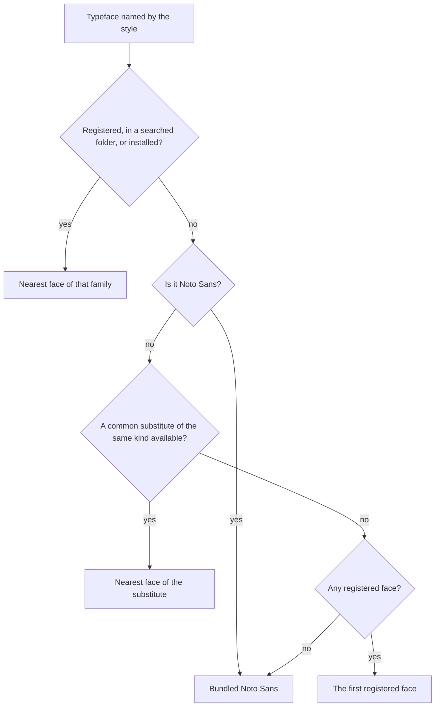
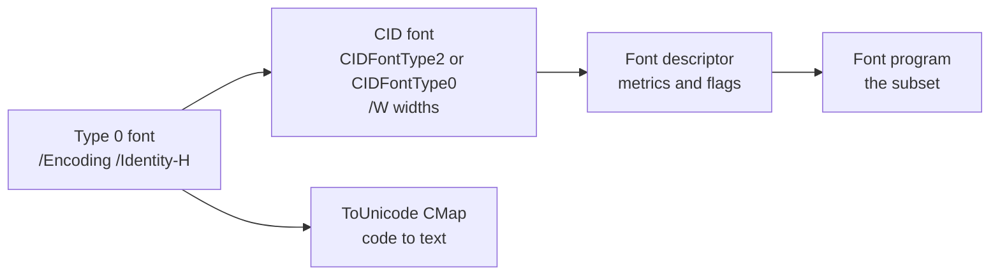

# Fonts

Text passes through two stages. While the document is laid out, each run's typeface is matched to a face, and each
character to a glyph in it. When the PDF is written, only the glyphs the document used are cut out of each face and
embedded, with what a viewer needs to copy and search the text. This page explains both. How glyphs are shaped and
set in lines is on [Text](text.md); how to register and name typefaces is in the
[text guide](../guide/text.md#typefaces).

## Where typefaces come from

Typefaces come from a [`TypefaceLibrary`](https://themidnightgospel.github.io/Rustaveli.Pdf/api/reference/Rustaveli.Pdf.TypefaceLibrary.html).
`TypefaceLibrary.Shared` serves every export whose
[`PdfExportOptions`](https://themidnightgospel.github.io/Rustaveli.Pdf/api/reference/Rustaveli.Pdf.PdfExportOptions.html)
name no library of their own. A library looks in three places, in this order:

| Where | Added by | Notes |
|---|---|---|
| Registered faces | `Register`, `RegisterFile`, `RegisterResource` | Loaded when registered, so a file that is not a font is refused at once |
| Searched folders | `SearchFolder` | Read as lazily as installed fonts |
| Installed fonts | Nothing: on unless `new TypefaceLibrary(includeInstalled: false)` | The platform's font folders |

A registered family shadows an installed family of the same name entirely, as a CSS `@font-face` rule does: once a
document supplies its own "Noto Sans", every request for Noto Sans is answered from it, and the output cannot change
with what happens to be installed. A library without installed fonts sees only what is registered with it, which is
the surest way to make a document come out the same everywhere.

### Installed fonts

Installed fonts are looked for in each operating system's usual folders, and the folders inside them:

| Platform | Folders |
|---|---|
| Windows | The system fonts folder (`C:\Windows\Fonts`, or `Fonts` under `%WINDIR%` on server editions that report none), then the per-user `%LOCALAPPDATA%\Microsoft\Windows\Fonts` |
| macOS | `/System/Library/Fonts`, `/Library/Fonts`, `~/Library/Fonts` |
| Linux and other Unix | `/usr/share/fonts`, `/usr/local/share/fonts`, `~/.local/share/fonts`, `~/.fonts` |

Files ending in `.ttf`, `.otf`, `.ttc` and `.otc` are read in sorted order, so the same folders always yield the same
fonts. A folder or file that cannot be read, or is not a font, is skipped: one broken file must not hide the rest.
The search stops twelve folders down, since Unix font folders are often trees of symbolic links that can loop.

### Read only as far as needed

A machine can have a thousand fonts, and a document typically uses two or three. So the installed fonts are read in
three steps:

1. **On first use**, the folders are scanned once for the whole process, reading only three small tables of each
   face: `name` for its names, `OS/2` and `head` for its weight, width and slant.
2. **When fallback asks** whether a face has a character, that face's character map alone is read.
3. **When a face is chosen**, its file is read into memory, once, however many threads choose it at the same moment.
   The faces of a collection share that one copy.

A thousand fonts cost a thousand small reads, not a gigabyte of font data. Registering swaps in a new, immutable
snapshot of the registered faces with fresh caches, so matching needs no process-wide lock and never serves an answer
made before the new faces arrived.

## Matching a face

A type style names a typeface, a weight and whether it is italic. The faces of the family are found first, then the
one closest to the style is picked.

A family is found by any name a document might use for it, ignoring case: the name it was registered under, if one
was given; its typographic family name, so "Specimen Sans" finds a semibold face whose older family name is "Specimen
Sans SemiBold"; its older family name; and last its full or PostScript name, so "NotoSans-Bold" finds that one face.
Each face's weight, width and slant come from its `OS/2` table, or, without one, from the bold and italic bits of its
`head` table.

The closest face is chosen by the font matching algorithm of CSS Fonts Level 4, which narrows the family by width,
then slant, then weight. Italic falls back to oblique before upright. For weight, a request between 400 and 500 tries
heavier weights up to 500, then lighter ones, then heavier ones; a lighter request looks lighter first and a heavier
one heavier first. So 600, in a family of 400 and 700, gets 700. The library does not draw a bolder or slanted
version of a face itself: a weight a family lacks is set in the nearest weight it has.

Faces whose outlines cannot go into a PDF are passed over: `CFF2` outlines, for which PDF has no font file type, and
bitmap-only faces, such as some colour emoji fonts. A family installed both ways, such as a variable font as TrueType
and as `CFF2`, is set in the face that can be embedded.

A variable font is one face, its default instance: its axes and named instances are not applied, so a weight it was
not drawn at is set in that instance as any family's nearest weight is. Only the default outlines are embedded.

### A typeface nobody has

A style may name a typeface that is neither registered nor installed. Rather than refuse the document, the library
substitutes, as a desktop publishing application would:

The substitutes follow what the name suggests. A monospaced name ("mono", "courier", Consolas) tries Courier New,
Courier, Liberation Mono, Nimbus Mono PS, Cousine, DejaVu Sans Mono and Noto Sans Mono. A serif name ("times",
Georgia) tries Times New Roman, Times, Liberation Serif, Nimbus Roman, Tinos, DejaVu Serif and Noto Serif. Anything
else tries Helvetica, Arial, Liberation Sans, Nimbus Sans, Arimo, DejaVu Sans, Noto Sans and Segoe UI.

## Characters a face lacks

Noto Sans has no Georgian; a Georgian face has no Chinese. Each character the chosen face lacks is looked for in:

1. the fallback typefaces the style names after its own, as in `WithTypeface("Noto Sans", "Noto Sans Symbols")`;
2. the library's `Fallbacks`;
3. the registered faces, closest in style first;
4. the searched folders, then the installed fonts, closest in style first and, among equally close faces, by family
   name, so the choice does not depend on the order the folders were read in;
5. the bundled Noto Sans.

If nothing has it, the chosen face draws it as its missing glyph — glyph 0, `.notdef`, usually an empty box.

Only the first two steps are under the document's control; the rest depend on the machine, which is why naming
fallbacks makes the choice the same everywhere. An installed "Last Resort" font, which has every character but shows
none of them, is never chosen.

The answers are cached: the face found for one character is tried first for the rest of its block of 128 code
points, which keeps a run of one script in one face, and characters no face has are remembered too. How text is
split into runs by face is described on [Text](text.md).

## The bundled Noto Sans

The core package carries four faces of Noto Sans — regular, bold, italic and bold italic — cut down to Latin, Greek
and Cyrillic, 55 to 58 KB each, under the SIL Open Font License. Noto Sans is also the typeface a style names when
it names none. The bundled faces are used:

- for text in Noto Sans when no Noto Sans is registered, in a searched folder or installed — so a document that
  names no typeface is set in them unless the machine has a Noto Sans of its own;
- for text in a typeface nobody has, when there is no substitute and nothing is registered;
- as the last fallback for a character in their scripts.

A machine with no fonts at all, such as a minimal container image, can still produce a document. Text in other
scripts, though, needs a typeface that has them, registered or installed.

## Reading OpenType

The parser reads TrueType and OpenType files, and collections of either. Loading a face reads its table directory
and the few tables everything else is sized by; the rest are parsed on first use and kept, so a face used only to
measure never parses its outlines.

| Table | What it gives | Read |
|---|---|---|
| `head`, `hhea`, `maxp` | Units per em, glyph count, bounding box | On loading; required |
| `hmtx` | Each glyph's advance and side bearing | Required |
| `cmap` | Characters to glyphs, from the subtable that best covers Unicode | Required |
| `OS/2` | Weight, width, slant, line metrics, cap height and x-height | On first use |
| `name` | Family, full and PostScript names | On first use |
| `post` | Italic angle, underline position and thickness | On first use |
| `glyf`, `loca` | TrueType outlines | When embedded |
| `CFF ` | PostScript outlines | When embedded |
| `GPOS`, `kern` | Pair kerning: `GPOS` when its `kern` feature has pairs, else the older `kern` table | On first measurement |
| `GSUB`, `GDEF` | Ligatures, contextual and stylistic forms, glyph classes | When text is shaped |

Font files are untrusted input. The parser checks the lengths, offsets and counts it reads against the data before
relying on them, and a malformed part of a face fails with an internal `FontFormatException` when that part is read.
A face whose substitution tables are broken is set without them, as other shapers do. The parsers are fuzzed
([ADR 0007](../adr/0007-quality-gates.md)).

WOFF and WOFF2 web fonts and PostScript Type 1 fonts are not read; such a file is refused with a message saying so.

## Embedding

### One Type 0 font per face

Each face a document uses becomes one font in the PDF, whatever sizes and pages it appears on: a Type 0 font with the
`Identity-H` encoding over a single CID font, so every glyph is shown by a two-byte code and a face can show any of
its glyphs, not just 256.

The CID font's registry and ordering are Adobe and Identity, and its widths are the face's, in thousandths of an em.
The font descriptor carries the bounding box, italic angle, ascent, descent, cap height, x-height and a stem width
estimated from the weight, and flags for fixed pitch, serif, script, italic and symbolic faces.

Pages are written as they are laid out, long before the last glyph is known. So the font's object number is reserved
when the face is first used, pages refer to it, and the font is written when the document finishes — see
[The PDF writer](pdf-writer.md).

### TrueType subsetting

A TrueType face's glyphs are numbered in the order the document first uses them. That number is both the code the
page shows and the glyph's index in the subset, so codes map to glyphs with `/CIDToGIDMap /Identity`, and a page can
be written before the subset exists.

When the document finishes, the subset is built from `.notdef`, every glyph used, keeping its number, and every glyph
those use as components, transitively: an "Å" drawn as an "A" and a ring needs both. Component references inside
composite glyphs are rewritten to the new numbers.

The subset holds only the tables a viewer needs to draw TrueType outlines — `head`, `hhea`, `maxp`, `hmtx`, `loca`,
`glyf` — plus a `cmap` for the characters kept and a `post` without glyph names, which validators expect. Bounding
boxes and extremes are recomputed over the glyphs kept. Names, layout tables, kerning and signatures are left out:
nothing reads them from an embedded CID font, and the names alone can outweigh a small subset. The subset's name
carries PDF's six-letter prefix ("ABCDEF+NotoSans-Regular"), made from a hash of the font's name and the glyphs kept,
so the same document gets the same name on every run. A document can use at most 32,767 glyphs of one TrueType face.

**Hinting** is TrueType's instructions for fitting outlines to a screen's pixel grid at small sizes: the `fpgm`,
`prep` and `cvt ` tables and the instructions in each glyph. Viewers mostly smooth type on their own, and print is
unaffected, yet hinting is often most of a small subset's bytes. So it is left out, the outlines untouched; the
library's tests check that "Hello, world" in Noto Sans comes out at under 70% of the size it has with hinting.
`PdfExportOptions.KeepFontHinting` keeps it. A few East Asian fonts, such as MingLiU, PMingLiU and DFKai-SB, build
their glyphs from strokes their instructions put in place and are unreadable without them; they are recognised by
name and always keep their hinting.

### CFF subsetting

A face with PostScript outlines in a `CFF ` table is shown by glyph index or, if the font is CID-keyed, by CID. When
the document finishes, the face is cut down to the glyphs shown as a CID-keyed CFF whose CIDs are those same codes,
so nothing written into the pages is renumbered; a name-keyed font becomes CID-keyed in the process.

CFF glyphs share outline fragments through global and local subroutines, and a Chinese font shares megabytes of
them. The subset keeps none: each glyph has the subroutines it calls written out in place. This needs care, because a
hint mask is followed by a byte for every eight stems declared so far, including stems declared inside a subroutine,
so the stems are counted as each glyph is rewritten.

Every font dict is kept, with its font matrix and its private dict less its subroutines; a name-keyed font's private
dict becomes the subset's one font dict. A CFF table with no font matrix is scaled by the face's units per em inside
an OpenType file but by a thousand once it stands alone, so a face whose em is not 1,000 units is given the matrix
that keeps its scale. The subset is embedded as a `CIDFontType0C` font program.

For scale: Noto Sans CJK SC, from which the library's Chinese test font is derived, is 16 MB. A document showing a
few dozen of its characters embeds those few dozen glyphs and nothing else.

A font this cannot carry over — a CFF version other than 1, several fonts in one table, or a glyph that computes a
subroutine number or uses the old `endchar` accent, among others — is embedded whole, as an OpenType font program. A
face from a collection is first written out as a file of its own, without its now invalid digital signature.

### Copying and searching: ToUnicode

A PDF shows glyphs, not characters. So that a viewer can copy, search and read the text aloud, each font carries a
ToUnicode map from every code back to the text it stands for.

Each glyph is recorded with the text it was first used for: one character, or all of a ligature's, so copying "office"
set with an "ffi" ligature gives back "office". A glyph can stand for different text, though — two characters a font
draws alike, or a letter form Arabic shares between letters. In a TrueType subset, a glyph used for other text than
its first gets a second code, from `0x8000` up, which a `/CIDToGIDMap` stream maps back to the glyph, so every code
reads back as what it showed. `.notdef` is never given text: it stands for every missing character, and mapping it
would turn each one into whichever went missing first.

### Missing glyphs

By default a character no face has is drawn as the missing glyph and the export succeeds — a box is better than a
failed document for drafts and user-supplied text.

With `PdfExportOptions.RequireEveryGlyph`, the export fails instead with a
[`MissingGlyphException`](https://themidnightgospel.github.io/Rustaveli.Pdf/api/reference/Rustaveli.Pdf.MissingGlyphException.html)
whose `Characters` lists every such character once, so they can all be fixed together. PDF/A and PDF/UA forbid
drawing the missing glyph, so claiming either turns the check on ([Standards](standards.md)). It runs after layout and
before the file is completed, so an export to a stream that fails this way leaves part of a file in it.
