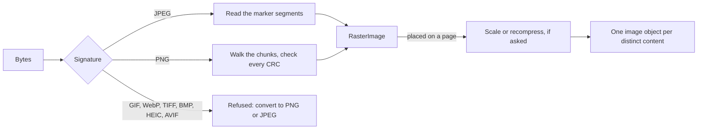

# Images

A document shows two kinds of picture. **Images** are pixels — JPEG and PNG files, loaded as
[`RasterImage`](https://themidnightgospel.github.io/Rustaveli.Pdf/api/reference/Rustaveli.Pdf.RasterImage.html).
**Artwork** is vector — SVG files and drawings made in code, held as
[`Artwork`](https://themidnightgospel.github.io/Rustaveli.Pdf/api/reference/Rustaveli.Pdf.Artwork.html) — and stays
vector in the PDF. This page follows both from the file to the page; how to place them is in the guide,
[Images and artwork](../guide/images-and-artwork.md).

## From file to page

`RasterImage.FromFile`, `FromStream` and `FromBytes` recognise the format by its leading bytes, then read the file's
headers and structure, and decode no pixel, so layout can measure an image without paying for it. The form the PDF
needs is worked out once, when the image is first embedded. A damaged file, or one using a feature that cannot be
embedded, fails with an `ArgumentException` saying why.

## JPEG: embedded as encoded

A JPEG is read only up to its first scan, where the compressed data begins: the frame header (size, components,
precision), the JFIF and Adobe segments, the EXIF orientation, and any ICC profile, reassembled from the numbered
segments a large profile is split over. The compressed data is never touched. The file goes into the PDF byte for
byte under the `DCTDecode` filter, and the PDF reader's own JPEG decoder decodes it: nothing is lost, and nothing
grows.

Two kinds of JPEG need a word to the reader. A three-component JPEG whose components are named `R`, `G` and `B`, with
neither a JFIF nor an Adobe segment, holds RGB rather than YCbCr, and is embedded with `/ColorTransform 0` so the
reader does not convert it. A CMYK JPEG with an Adobe segment, as Photoshop writes them, stores every value inverted,
and is embedded with a `/Decode` array that inverts them back.

Some valid JPEGs are refused rather than written into a file some viewers would show blank:

| The JPEG has | Why it is refused |
|---|---|
| A lossless, hierarchical or arithmetic-coded frame | PDF readers are only required to decode the Huffman-coded baseline, extended and progressive processes |
| Samples of other than 8 bits | PDF readers decode only 8-bit JPEGs |
| Other than 1, 3 or 4 components | PDF has colour spaces for grey, colour and CMYK only |
| Its height in a DNL marker | Readers need not honour it, and it cannot be found without walking the compressed data |

## PNG

The loader checks the CRC of every chunk. The chunks that make up the image — `IHDR`, `PLTE`, `IDAT`, `IEND` — are
held to the specification, and an unknown critical chunk rejects the file. Damaged ancillary chunks are ignored, as
libpng and browsers ignore them: a broken gamma value is no reason to refuse intact pixels. Of the colour information
a PNG can carry, only an ICC profile changes how the image is embedded.

### Passed straight through

A PNG's image data is a zlib stream of rows, each beginning with a byte that says how the row was filtered — and
PDF's `FlateDecode` filter with `/Predictor 15` is defined to read exactly that. So a PNG that PDF can represent as it
is — not interlaced, with no alpha channel, and with any transparency expressible as a colour key — is embedded by
joining its `IDAT` chunks together: no inflating, no filtering, no deflating. That includes 16-bit images, which PDF
has allowed since version 1.5.

### Decoded and compressed again

Everything else is decoded and compressed again: interlaced images, since PDF knows no interlacing; and images with
an alpha channel or a partly transparent palette, since PDF keeps opacity apart from colour, in a *soft mask* — a
greyscale image of the same size giving each pixel's opacity.

Decoding inflates the data, verifies its Adler-32 checksum and undoes the row filters and interlacing. The pixels go
out as two streams, colour and soft mask, filtered again and at their own bit depth: nothing is rounded. An alpha
channel that turns out fully opaque, which is common, is dropped.

| The PNG | In the PDF |
|---|---|
| Grey or RGB, any bit depth, not interlaced | The PNG's own data, as it was |
| A palette | An `Indexed` colour space, the palette as its lookup table |
| Grey or RGB with a `tRNS` colour | A `/Mask` colour key: pixels of that colour are not painted |
| A palette whose transparent entries are fully transparent and form one run of indices, the rest opaque | A `/Mask` over that range of indices |
| A palette with partial transparency, or transparent entries scattered | Decoded, with an 8-bit soft mask from the palette's alpha |
| Grey or RGB with alpha | Decoded, with a soft mask at the alpha channel's bit depth |
| Interlaced | Decoded, and written row by row |

### ICC profiles

A profile is used only if its header checks out and it describes the image's own colour space: grey for a greyscale PNG
and RGB for any other, or as many components as the JPEG has. PDF states the number of components separately, and a
reader given a profile that disagrees rejects the image or shows wrong colours; so a profile that fails is dropped,
and the image falls back to the device colour space, as browsers do. One that passes becomes an `ICCBased` colour
space.

## EXIF orientation

Cameras store pixels as the sensor read them and record in EXIF which way is up. PDF viewers ignore EXIF, so the
image is embedded as stored, and the transformation that places it on the page turns or mirrors it, for all eight
orientations. `PixelWidth` and `PixelHeight` report the image upright: a stored 4000 × 3000 photograph with a quarter
turn is 3000 pixels wide. An EXIF block that cannot be read counts as upright, as viewers treat it.

## Shared by content

An image placed many times is embedded once, matched by its bytes rather than by which `RasterImage` holds it: the
same logo loaded twice is one image in the PDF. An XXH64 hash finds candidates cheaply, and a byte-for-byte comparison
confirms a match. ICC profiles are shared the same way.

## Fitting and scaling

An image fills the space its frame gives it by its
[`ImageFitting`](https://themidnightgospel.github.io/Rustaveli.Pdf/api/reference/Rustaveli.Pdf.ImageFitting.html),
in its upright proportions:

| `ImageFitting` | Size |
|---|---|
| `FitWidth` (default) | The frame's width; the height follows in proportion |
| `FitHeight` | The frame's height; the width follows in proportion |
| `Proportionally` | Whichever of those two fits inside the frame |
| `Stretch` | The frame's width and height, in or out of proportion |

An image whose fitted size does not fit — a `FitWidth` image too tall for what is left of the page, say — moves on
to the next page (see [How layout works](layout.md)). The image is scaled by the PDF's transformation
matrix, not resampled: the viewer scales the pixels as it draws. Artwork is fitted by the same rules and clipped to
its own bounds.

## Recompression and downsampling

A 4000 × 3000 photograph shown three inches wide carries far more pixels than the page needs. Two settings trade
them away, on [`PdfExportOptions`](https://themidnightgospel.github.io/Rustaveli.Pdf/api/reference/Rustaveli.Pdf.PdfExportOptions.html)
for every image, or on one image with `WithMaximumResolution` and `WithQuality`, which take precedence:

- **A maximum resolution** caps the pixels at what the image needs where it is shown: its shown size in points,
  divided by 72 and multiplied by the pixels per inch, rounded up, and never more than it has. The photograph above,
  shown 216 × 162 points at 150 pixels per inch, is embedded at 450 × 338 pixels.
- **A quality**, from 1 to 100, recompresses the image as JPEG.

Both need an [`IImageProcessor`](https://themidnightgospel.github.io/Rustaveli.Pdf/api/reference/Rustaveli.Pdf.IImageProcessor.html),
since the core decodes no JPEG; without one the export fails with an `InvalidOperationException`. The Raster package's
[`SkiaImageProcessor`](https://themidnightgospel.github.io/Rustaveli.Pdf/api/reference/Rustaveli.Pdf.SkiaImageProcessor.html)
turns the image upright, scales it with a Mitchell cubic filter, and writes a JPEG at the quality asked for, or a
lossless PNG where the image has transparency or no quality is asked. The same image at the same size is processed
once. Under PDF/A, a CMYK image with no profile is converted to RGB this way, at quality 95 unless another is set
(see [Standards](standards.md)).

## SVG

[`Artwork.FromSvg`](https://themidnightgospel.github.io/Rustaveli.Pdf/api/reference/Rustaveli.Pdf.Artwork.html)
reads an SVG document into artwork drawn as PDF paths, not as a picture of them, at the size the document gives
itself, three quarters of a point to the CSS pixel.

| Read | Details |
|---|---|
| Shapes | `path`, `rect` with rounded corners, `circle`, `ellipse`, `line`, `polyline`, `polygon` |
| Structure | `g`, `a`, nested `svg` viewports (clipped), `use`, and `symbol` through `use` |
| Coordinates | `transform`, `viewBox` with `preserveAspectRatio` |
| Paint | Named colours, hexadecimal, `rgb()`, `rgba()`, `hsl()`, `hsla()`, `currentColor`; fill rules; stroke widths, caps, joins, miter limits and dashes |
| Opacity | `opacity`, `fill-opacity`, `stroke-opacity`, `stop-opacity` |
| Gradients | Linear, in box or user-space units, with `gradientTransform` and inherited stops |
| Clipping | Clip paths in user-space units |
| Text | Each `text` element as one line at its first `x` and `y`, in its font family, size, weight, style and anchor |
| Images | JPEG and PNG carried in the document as base64 `data:` URIs |
| Styles | Presentation attributes, then `<style>` rules for element, class and id selectors, then the `style` attribute |

What the reader leaves out:

- **Radial gradients** are painted in the mean of their colours.
- **Filters, masks, patterns and markers** are not drawn, and **animation** is not played.
- **Text positioning** inside a `text` element — `tspan` coordinates, text on a path — is not followed.
- **Anything outside the document** — linked images, external entities — is never fetched, and clip paths in
  bounding-box units are not applied.
- **Group opacity** is carried down to each fill and stroke rather than blending the group as one, so shapes that
  overlap inside a translucent group show through one another.

An SVG becomes the same kind of artwork as `Artwork.Draw` makes from an
[`ArtworkComposer`](https://themidnightgospel.github.io/Rustaveli.Pdf/api/reference/Rustaveli.Pdf.ArtworkComposer.html):
a recording of drawing, played back each time it is placed.

## Made for their box

A chart is sharpest drawn at exactly the size it is shown, which only layout knows. `Image(request => ...)` and
`Artwork(size => ...)` take a function that is called with the space allotted:

- For an image, the function is given an
  [`ImageRequest`](https://themidnightgospel.github.io/Rustaveli.Pdf/api/reference/Rustaveli.Pdf.ImageRequest.html) —
  the box in points, and the pixels it takes at the export's `ImageResolution`, 288 per inch unless set — and returns
  an encoded JPEG or PNG, embedded like any other image.
- For artwork, the function is given the box's size and returns artwork, such as an SVG written for that size, which
  is stretched to fill the box.

Either takes all the room it is given, and returning nothing leaves the box empty. The functions are not called while
pages are only being counted.

## Safety limits

Images often come from outside the program, so the loaders treat every byte as hostile. A few forged header bytes
cannot demand gigabytes or hours:

| Limit | What it prevents |
|---|---|
| At most 2^28 pixels (16384 × 16384, say) | A header claiming an absurd size |
| At most 1 GiB read from a stream or file | Unbounded reading |
| Image data refused if it could not hold what the header promises — deflate expands data at most 1032 times | Decompression bombs, caught before anything is allocated |
| Compressed data past the image inflated no further than the image's size, or 64 KiB for a small one | Tails that expand without end |
| An ICC profile inflated to at most 16 MiB | The same, for profiles |
| An interlaced image refused if it needs a larger buffer than .NET can allocate | The one whole-image buffer decoding needs |
| Every PNG chunk's CRC checked, and the Adler-32 checksum of any data decoded | Damage that inflates silently to the wrong pixels |
| SVG elements nested at most 64 deep, and a `use` that refers back to itself ignored | Unbounded recursion |
| SVG entities expanded to at most ten million characters, and nothing external resolved | Entity expansion attacks and fetching |

Every structural problem is reported as a malformed image, never as an index or overflow error. The tests cut sample
files at every length, damage them at random and byte by byte, and feed in PngSuite's corrupt files and a
decompression bomb, which must be refused before a megabyte is allocated. The
[security policy](https://github.com/themidnightgospel/Rustaveli.Pdf/blob/main/SECURITY.md) advises processing
untrusted files where a failure cannot take other work down with it.

That what is embedded shows as intended is checked by a reader sharing no code with the library: every test image —
each PNG colour type and bit depth, interlaced or not, with each kind of transparency, and the JPEG variants — is
rendered by PDFium and compared pixel by pixel with SkiaSharp's decoding of the original.
