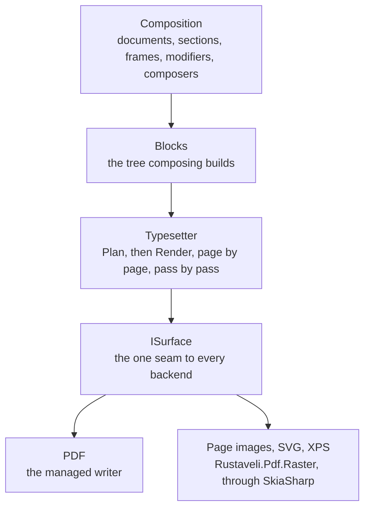
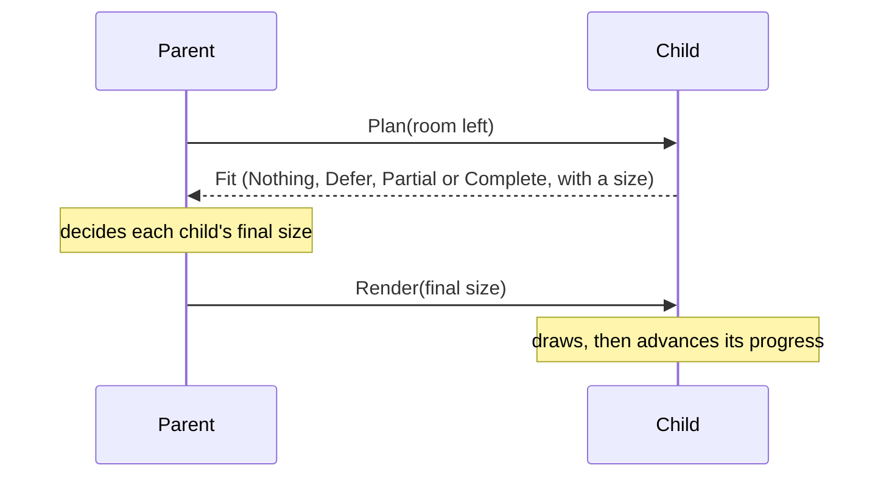
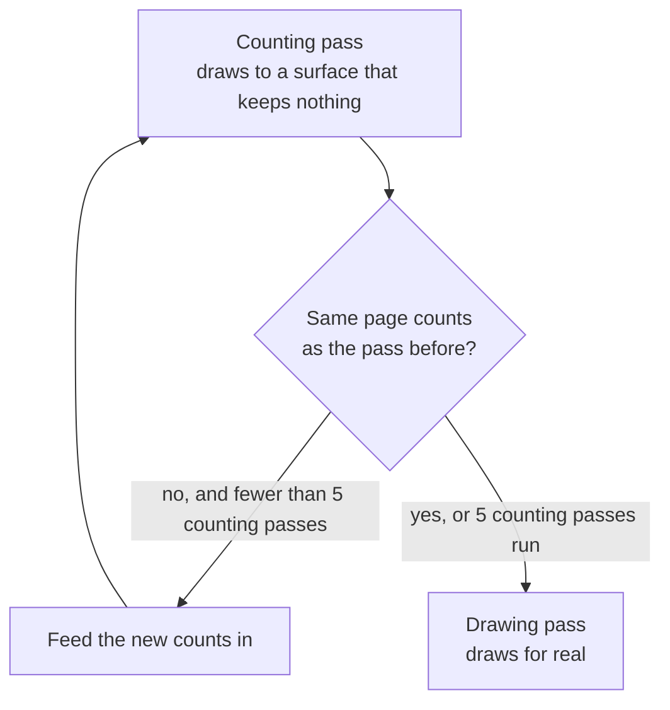

# How layout works

This page follows a document from the code that composes it to the pages that come out, and explains how the
answers blocks give about the room left on a page decide where every page breaks. The
[layout guide](../guide/layout.md) shows how to use the pieces.

## From composition to pages

The library is split so that layout never depends on how shapes, text or images are finally produced.



Only the composition layer is public. Blocks, the typesetter and the drawing surface are internal, so the engine can
change without breaking code that uses it.

### Composition

[`Document.Compose`](https://themidnightgospel.github.io/Rustaveli.Pdf/api/reference/Rustaveli.Pdf.Document.html)
runs your composing code once. Each call to `Section` adds a
[`Section`](https://themidnightgospel.github.io/Rustaveli.Pdf/api/reference/Rustaveli.Pdf.Section.html): a run of
pages sharing a trim, margins, paper, reading direction and default type. A section has five slots, each an
[`IFrame`](https://themidnightgospel.github.io/Rustaveli.Pdf/api/reference/Rustaveli.Pdf.IFrame.html): the
`Underlay` and `Overlay`, which cover the whole sheet and ignore the margins; the `RunningHead` and `RunningFoot`,
repeated on every page; and the `Body`, the only one that flows from page to page.

A frame holds exactly one piece of content. The modifiers in
[`FrameModifiers`](https://themidnightgospel.github.io/Rustaveli.Pdf/api/reference/Rustaveli.Pdf.FrameModifiers.html)
— `Inset`, `Fill`, `KeepTogether` and the rest — each put a block into the frame and hand back that block as the
frame for what comes next, so a chain such as `.Fill(...).Inset(6).Text("B")` nests three blocks, one inside the
other. Composers such as
[`StackComposer`](https://themidnightgospel.github.io/Rustaveli.Pdf/api/reference/Rustaveli.Pdf.StackComposer.html),
[`ColumnsComposer`](https://themidnightgospel.github.io/Rustaveli.Pdf/api/reference/Rustaveli.Pdf.ColumnsComposer.html)
and [`TableComposer`](https://themidnightgospel.github.io/Rustaveli.Pdf/api/reference/Rustaveli.Pdf.TableComposer.html)
hand out a frame for each item, cell or column. Filling a frame a second time is refused with a
`CompositionException`, rather than silently dropping what it held.

### The block tree

What composing builds is a tree of `Block` objects. A modifier's block wraps a single child and changes one thing
about it: an inset shrinks the room, a fill paints behind. Composers make blocks with many children — `StackBlock`,
`ColumnsBlock`, `TableBlock` — and leaves such as `TextBlock` and `ImageBlock` hold the content itself. The
typesetter, which turns the tree into pages, is described under [pagination](#pagination).

The tree is also where progress is kept: a paragraph remembers how many of its lines it has set, a table how many of
its rows. So one tree is laid out by one export at a time; an export that starts while another is under way runs the
composing code again for a fresh tree, and the same `Document` can be exported from several threads at once.

## The fitting contract

Every block answers one question before anything is drawn: *given this much room, what would you do?* The question
is `Plan(space)` and the answer is a `Fit`, which has four outcomes.

| Outcome | Meaning |
|---|---|
| `Nothing` | Nothing is left to set. A continuation page must not give it room again. |
| `Defer` | It cannot start here at all; the whole of it moves to the next page. Carries a reason. |
| `Partial` | It sets what fits, at the size it reports, and the rest continues on the next page. |
| `Complete` | It sets everything, at the size it reports. |

Once the parent has decided, it calls `Render(space)`, which draws and advances the block's progress so that the next
page continues where this one stopped.



Three rules make this work.

**`Plan` changes nothing that matters.** The engine plans speculatively, often several times for the same page, and
throws most answers away. A block may remember results that do not depend on progress — a table keeps its column
widths and row heights, a row of columns their widths — but it must never advance how far it has got while planning.

**`Render` uses only the room `Plan` promised.** A block that drew more would overflow silently, since its parent
has already placed the next thing below it.

**Parents allot the final size** ([ADR 0012](../adr/0012-parents-allot-final-size.md)). A stack gives each item the
full width and the height the item planned; a row gives each column its width and the row's height; a table
gives a cell the width of the columns it spans and the height of its rows; layers give every layer the whole box. The
allotted size is never smaller than what the child planned, and decorators such as `Fill` and `Stroke` paint the size
they are given rather than planning their content again. That is why a fill on a table cell reaches the edges of the cell,
not just the end of its text.

Some layout can only know where content ends by laying it out: text flowing through
[newspaper columns](../guide/layout.md#grids-flows-and-flowing-columns) does not know where the second column starts
until the first is filled. Such a block saves its content's progress, draws it onto a surface that keeps nothing,
notes where it ended and restores the progress ([ADR 0016](../adr/0016-drawing-ahead.md)); balancing the columns
narrows in on the shortest height by halves, in sixteen trials a page.

## Pagination

For each page of a section, the typesetter:

1. clears the running head and foot, the underlay and the overlay of what they drew on the previous page;
2. plans the running head in the page's content area, then the running foot in what is left;
3. plans the body in the room between them;
4. sizes the page — fixed, or between the section's minimum and maximum trim for pages sized by their content;
5. draws the page;
6. starts another page if the body's answer was `Partial`, and moves on to the next section otherwise.

A section therefore always produces at least one page, even with an empty body.

### When a page cannot help

When a block answers `Defer`, its parent stops before it, and the block is asked again at the top of the next page.
But every page starts empty. If the body defers on an empty page, no further page could ever be different, so instead
of looping the typesetter raises an
[`OversetException`](https://themidnightgospel.github.io/Rustaveli.Pdf/api/reference/Rustaveli.Pdf.OversetException.html).
To explain it, the typesetter first plans the body once more with tracing switched on — planning changes nothing, so
doing it again is safe — and the message follows the refusal down from the page to the frame that could not fit:

```text
The body cannot be set even on an empty page, so no further page would help. Space available: 200 × 150 pt.
Reason: ...
Where it did not fit, from the page down:
  Image, offered 200 × 150: does not fit — ...
```

A second guard catches content that keeps answering `Partial` while taking no room: once a document passes its
`PageLimit`, 10,000 pages unless set, layout fails rather than running on.
[Preview and debugging](../guide/preview-and-debugging.md#reading-a-layout-failure) shows how to read these failures.

## How content splits across pages

Each kind of block decides for itself where it may break. A paragraph breaks between lines — see
[the text engine](text.md#paragraphs-across-pages). A single line, an image or a rule cannot break at all, and moves
whole.

### Stacks

A stack plans its remaining items one after another, each in the height the ones before it left. An item that
completes is placed and the next one is tried; an item that answers `Partial` is placed and the stack stops, answering
`Partial` itself; an item that defers stops the stack before it. If the very first item defers, nothing has been set,
so the stack defers as a whole, which carries the question up to the page.

Spacing goes only between items that take up height. An item that takes none is still drawn where it falls, since
what it does — registering a destination, say — belongs on that page, but it adds no gap.

### Rows of columns

A row plans every unfinished column at its width and is as tall as the tallest. If any column is `Partial`, the whole
row is `Partial`. On the next page the columns that finished answer `Nothing` while the others continue, and every
column keeps its slot, so the continuing ones stay where they were rather than sliding sideways. A column wrapped in
`RepeatOnEachPage()` is drawn afresh beside the others on every page, but never keeps the row going on its own.

Fixed columns cannot shrink. A row whose fixed widths and gutters are wider than the room it is offered defers, and
since an empty page is no wider, that ends in an `OversetException`.

### Tables

Tables break only between rows, and never inside a group of rows joined by a cell that spans them: a cell spanning
three rows moves with all three. Header and footer rows are set on every page the table reaches.

On each page the table plans its header and footer rows and fits whole body rows into the room they leave, from
where it stopped. A row is as tall as its tallest cell; a spanning cell that needs more height than its rows give it
adds the difference to its last row. Body row heights are worked out once per pass and kept, while the header and
footer are planned afresh on every page, so that a `SkipFirst()` "continued" label can make the header taller after the
first page.

What happens to a table that does not fit:

- The next row does not fit in what is left of this page: the table sets the rows that do and answers `Partial`, and
  continues on the next page below its header rows.
- Not even one row fits here: the table defers, and starts on the next page.
- The header and footer rows alone are taller than the room: the table defers.
- A single row, or group of spanned rows, is taller than an empty page's body less the header and footer: no page can
  hold it, and export fails with an `OversetException` whose reason is that the next table row is taller than the
  available height. Rows are kept whole so that cell borders and backgrounds stay coherent, at the cost of this case.

### Keeping content together

`KeepTogether()` turns a `Partial` answer into `Defer`, so its content moves whole to the next page. If it is taller
than an empty page it fails with an `OversetException`, rather than being cut. `KeepTogetherWherePossible()` first asks
whether moving would help: when the content would not fit whole on a fresh page either, or it is already being offered
a whole page, it splits where it is, as it would without the modifier.

`RequireSpace(height)` defers its content unless at least that much height is left, so that a heading is not stranded
at the foot of a page. The requirement applies only before the content starts; once it has set something, later pages
continue it without asking again.

## Running heads, feet and per-page state

The running head and foot are set in full on every page and never paginate. But their content is made of the same
blocks as the body, which track how much of themselves they have set: a paragraph in a running head would report
`Nothing` on page two, having set all its lines on page one.

So the typesetter resets them before every page, and tables and banded content reset their repeated rows after
each page. This softer reset clears progress through the content but keeps progress through the document, so a
`Once()` frame in a running head still appears only on the first page. Getting this distinction wrong is what once
made table header rows vanish after the first page — a defect the equivalence suite caught.

The head sits against the top margin and the foot against the bottom margin, not directly below the body; the body is
drawn in the whole room between them, which is at least the room it planned.

## Counting passes

"Page 3 of 12" cannot be set in one pass, because the total is unknown until pagination has finished. The typesetter
therefore sets the whole document more than once.



During the first counting pass the total is not known, so each page quotes its own number as the total: "3 of 3"
takes a realistic width. The second pass is told the real total. Feeding it back can change the answer — "of 9" is
narrower than "of 10", so learning the real total can wrap a footer onto a second line, shrink the body and add a page —
so counting repeats until two passes agree. Every document is therefore set at least three times: two counting passes
and the drawing pass. A document whose count never settles is counted five times and then drawn with the last count.

Every pass runs the same layout code, so the passes cannot disagree about where pages break. Anchors are carried from
one pass to the next, which is how a table of contents on page one can name the page of a chapter it has not reached
yet.

Counting passes draw to a `CountingPageSink`, which discards every drawing but follows the transforms, so positions
that content records are still right. They are cheaper than the drawing pass: paragraphs skip lines of plain text
altogether, and images and artwork generated at their final size are not generated.

## Draw order and layers

Content is drawn in the order it comes, each thing over what came before. On a page, that order is:

1. the paper colour;
2. the underlay;
3. the running head;
4. the body;
5. the running foot;
6. the overlay.

Within the body, a layered frame draws its layers in the order they were added, so a watermark added before the base
layer lies beneath the text; every layer is given the box the base layer decides.

`DrawOrder(order)` changes this without moving the content in the layout
([ADR 0017](../adr/0017-draw-order.md)). A section that uses it draws each page onto a `LayeredPageSink`, which holds
every drawing back — with the chain of transforms and clips it was made under — until the page ends, then draws them
lowest order first, keeping the order they were made in within one order. The paper stays beneath everything. Sections
that set no draw order, and every counting pass, draw directly and pay nothing for it.

## The drawing surface

Blocks never call a graphics library. They draw through `ISurface`, a small internal interface — transforms and
clips, shapes, paths, images, text, links, bookmarks and structure tags — and a page sink adds `BeginPage` and
`EndPage`.

| Surface | Package | What it does |
|---|---|---|
| `PdfSurface` | Rustaveli.Pdf | Writes PDF content streams through the managed writer — see [the PDF writer](pdf-writer.md) |
| `SkiaRasterSurface` | Rustaveli.Pdf.Raster | Draws pages with SkiaSharp: PNG, JPEG or WebP images, SVG, and XPS on Windows — see [rendering and preview](rendering-and-preview.md) |
| `CountingPageSink` | Rustaveli.Pdf | Discards everything; used by counting passes and by layout that draws ahead |
| `LayeredPageSink` | Rustaveli.Pdf | Holds a page back and passes it on in draw order |

Text crosses the seam as text, not as glyphs: `ShowText` takes the string and its `TypeStyle`, and each backend asks
the same shaper that layout measured with for the glyphs. The PDF and the page image of a document therefore agree
glyph for glyph with each other and with the layout ([ADR 0014](../adr/0014-text-is-shaped-once.md)). How that shaper
works is the subject of [the text engine](text.md).
