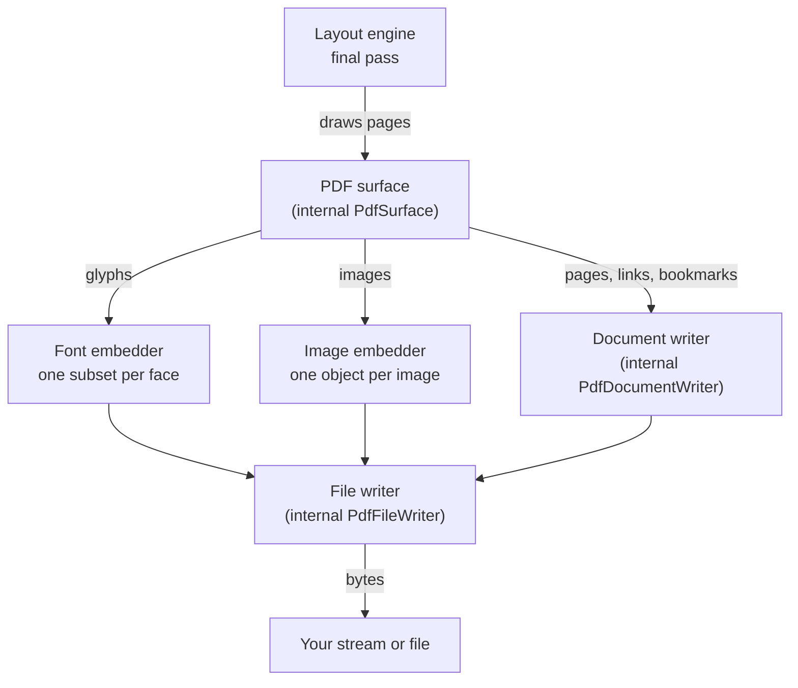
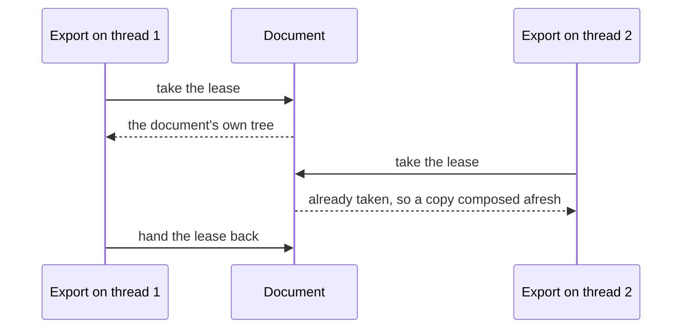

# The PDF writer

A PDF file is a set of numbered objects — dictionaries, arrays, numbers, strings and streams of bytes — that refer to
one another, followed by an index saying where each object starts. Rustaveli.Pdf writes that file itself, in managed
code, from the pages the layout engine draws. This page follows a document from the last layout pass to the final
byte, and explains the choices made on the way. The options that steer it are listed in the
[output guide](../guide/output.md).

## Why a managed writer

The library first rendered PDF through SkiaSharp. [ADR 0001](../adr/0001-managed-pdf-writer.md) records why that was
replaced:

- **No font subsetting.** Skia embedded every typeface whole: a one-page document came to about 570 KB, where a
  subsetting writer produces about 32 KB.
- **Process-wide font state.** Concurrent renders corrupted each other's font encodings, silently, so generation had
  to hold a global lock and could not use more than one core.
- **No access to the document's structure.** Tagging, encryption, attachments and the other document-level
  structures that PDF/UA, PDF/A-3 and electronic invoices need were out of reach.

A managed writer puts file size, parallel scaling and every document-level feature in the library's hands, and runs
anywhere .NET runs, trimmed and ahead-of-time compiled applications included. The cost is owning an implementation of
the specification, so the output is checked by independent tools rather than the library's own reader: qpdf for
structure, veraPDF for PDF/A and PDF/UA, and an independent renderer for the pages
([ADR 0007](../adr/0007-quality-gates.md)).

## From layout to file

The layout engine sets a document more than once: first to count its pages, drawing to a sink that throws
everything away, and then for real (see [Layout](layout.md)). Only that last pass reaches the PDF writer. The writer
is built in three layers:

- The **surface** turns drawing — paths, text, images, links — into content-stream operators. It is the PDF
  implementation of the one drawing seam the layout engine talks to ([How layout works](layout.md)).
- The **document writer** knows PDF's logical structure: pages, the page tree, the catalog, named destinations, the
  outline and the information dictionary.
- The **file writer** knows its physical structure: the header, numbered objects, streams, compression, the
  cross-reference section and the trailer.

## The object model

Values are a single internal struct, `PdfValue`, that holds any of PDF's direct objects: null, a boolean, an
integer, a real, a name, a string, an array, a dictionary or a reference to a numbered object. It is a struct rather
than a class hierarchy because documents are mostly numbers — coordinates, widths, offsets — and giving each its own
heap object would make allocation grow with the content.

Streams are deliberately not a kind of value. PDF allows a stream only as a numbered object of its own, never inside
another value, so streams are written by the file writer directly and the type system rules the invalid nesting out.

Every object has a number, handed out by the file writer. A number can be **reserved** before its object is written,
which lets objects refer to one another in any order: a page names its parent in the page tree before the parent is
written, and a font is referred to by every page that uses it and written only at the end. The writer refuses to
finish a file in which a reserved number was never written, and refuses to write an object that is nothing but a
reference to another, which strict readers reject.

Numbers are written without exponents, as PDF requires, with at most five decimals and, from 100 up, at most seven
significant digits. The layout engine computes in single precision, and 559.28 widened to double precision is
559.280029296875; seven significant digits round that noise away, so the file says 559.28.

## Pages are written as they are drawn

The writer does not hold the document. When a page begins, its object number is reserved and it is added to the page
tree. Drawing fills that page's content stream in memory. When the page ends, its content stream and its page
object are written out at once, and the page's buffers are released, so a long document holds little more than the
page being drawn and the small objects waiting to fill an object stream (see below). Output reaches your stream
whenever about 64 KB of it has accumulated.

Some things can only be written at the end, and are kept until then:

| Kept until the end | Why |
|---|---|
| Fonts | A subset can be built only once no page will use another glyph ([Fonts](fonts.md)) |
| Page tree nodes above the leaves | Their shape depends on the final page count |
| Named destinations and the outline | A link on page 1 may lead to a heading on page 90 |
| The structure tree of a tagged PDF | It spans the whole document ([Standards](standards.md)) |
| The catalog, information dictionary and cross-reference section | They describe the whole file |

These are small next to the pages: glyph lists, references and titles. Images, by contrast, are written the first
time they are drawn.

The page tree is balanced — leaves of at most 32 pages, under parents of at most 32 nodes — so a viewer finds page
5,000 of a long document by descending a few levels rather than scanning one list of thousands.

Because output streams out, an export to a stream that fails part-way leaves part of a document in it. Exporting to a
path avoids that: the file is written beside its destination under a temporary name, and moved into place only once
it is complete, so a failed export leaves whatever was there before untouched.

## Content streams and resources

Each page's content stream is a list of operators, one per line. The layout engine draws with the origin at the top
left and Y running down; PDF puts the origin at the bottom left with Y running up. So each page begins by flipping its
coordinate system, and text and images are flipped back where they are placed, so that they read the right way up.
The content stream builder checks nesting as it goes — every saved graphics state restored, text objects neither
nested nor containing a saved state, marked content closed — and a page that ends unbalanced is refused, because
viewers misrender such streams without complaint.

Text is shown with the same glyphs that layout measured, as two-byte codes (see [Fonts](fonts.md)). The font's own
widths position each glyph; kerning, word spacing and any other difference from those widths are written as
adjustments in the text array, and a glyph moved off the pen position, such as a mark placed on its letter, starts a
new array placed exactly. Colour and opacity are written only when they change.

Operators refer to fonts, images, graphics states, colour spaces and patterns by short names, which each page's
resource dictionary maps to objects: `/F1`, `/F2` for fonts, `/X1` for images, `/GS1` for graphics states, `/CS1` for
colour spaces and `/P1` for patterns, numbered in order of first use on that page. The names are local, so one font
may be `/F1` on one page and `/F2` on another; the object behind them is the same. A page with nothing drawn on it
has no content stream at all.

## Compression

Streams are compressed with Flate, in the zlib format. .NET Standard 2.0 has no `ZLibStream`, so the library wraps
`DeflateStream`'s output in the zlib header and checksum itself: the same code, and the same bytes, on both targets.

A stream shorter than 32 bytes is never compressed, since zlib's framing would outweigh any saving, and a stream is
written compressed only if compression actually made it smaller. Data that is already encoded is written as it is:
JPEG images under their `DCTDecode` filter, and PNG image data under Flate with its predictor
([Images](images.md)). The XMP metadata stream is left uncompressed so that tools scanning a file for it find it.

`PdfExportOptions.Compress = false` turns compression off for everything, which makes content streams readable in a
text editor — useful when debugging what was drawn.

## Object streams and cross-reference streams

Since PDF 1.5, a file may pack its objects into compressed **object streams** and index them with a compressed
**cross-reference stream**, instead of writing every object as plain text and indexing them with a table of
twenty-byte lines. The library always writes the compact form, with a `%PDF-1.7` header:

- Every object that is not itself a stream — page dictionaries, annotations, font dictionaries, the catalog — goes
  into an object stream, a hundred objects to each. Such dictionaries are small and repetitive, and compress well
  together; a hundred is large enough to share a compression window, and small enough that a reader need not inflate
  much to reach any one object. An object stream is written when it fills, so these objects reach the output in
  batches.
- Streams — content, fonts, images — are written directly, each at its own offset.
- The cross-reference stream lists every object's offset, or its object stream and index. Its rows are encoded with
  the PNG "Up" predictor, each byte stored as its difference from the byte above; consecutive rows differ in a byte
  or two, so the result is mostly zeros and deflates to a fraction of its size.

The writer has the classic cross-reference table too, but exports do not use it.

## Written once, shown anywhere

Anything shown more than once in a document is written once and referred to wherever it appears:

- **Fonts**: one embedded font per face, holding every glyph any page used ([Fonts](fonts.md)).
- **Images**: matched by content, not by instance, so the same logo loaded twice is still embedded once. A hash
  finds candidates and a byte comparison confirms them. Colour profiles are shared the same way.
- **Opacity**: one graphics state per distinct pair of fill and stroke opacity.
- **Shadows**: identical blurred shadows, such as those of a table's cells, share one image.
- **Spot inks**: one separation colour space per ink ([Colour](colour.md)).

This sharing is per document. Across documents, what is shared is the parsed typefaces, so a font read for one export
is not read again for the next.

## Document information and metadata

[`DocumentInfo`](https://themidnightgospel.github.io/Rustaveli.Pdf/api/reference/Rustaveli.Pdf.DocumentInfo.html)
becomes the file's information dictionary: title, author, subject, keywords, creator, producer and the creation and
modification dates. Fields not set are left out. The producer is "Rustaveli.Pdf" unless you set another, and the
dates are written only if you set them; they are written in the offset they carry, so a document stamped in Tbilisi
reads back in Tbilisi time. `Language` becomes the catalog's `/Lang`, which screen readers speak the text in.

When the document claims PDF/A or PDF/UA, the same information is also written as XMP metadata, the XML that those
standards read, together with the parts and levels claimed ([Standards](standards.md)).

## Deterministic output

The same document, exported twice with the same options and typefaces, produces the same bytes. Nothing in the file
comes from a clock or a random number:

- The dates are written only if the document sets them.
- The file identifier, `/ID` in the trailer, is the first 16 bytes of a SHA-256 hash of everything written before
  it. It identifies this content and nothing else.
- Subset font names carry a tag made from a hash of the font's name and the glyphs kept.
- Installed fonts are read in sorted order, and ties between equally good fallback faces are broken by family name.

That makes generated PDFs safe to compare in tests, to cache by content, and to rebuild reproducibly. The library's
own tests generate the same document on many threads at once and require every result to match, byte for byte, the
one generated alone.

!!! note
    A password-protected file is the exception. Its identifier is chosen at random, and so are the keys it is
    encrypted with, so each export differs ([Encryption](encryption.md)).

## Links, destinations and bookmarks

A link to a web address becomes a link annotation whose action opens the URI, with anything outside 7-bit ASCII
percent-encoded as UTF-8, as PDF requires. Links have a zero-width border, since viewers following the
specification's default would draw a black box around each, and are marked to print, as PDF/A requires.

A link within the document goes to a **named destination**: where an anchor is drawn, its name is registered with
the page and point, to be shown at the top left of the window at the reader's current zoom. The first anchor of a
name wins. At the end the names are written as a name tree, sorted by their bytes and split into balanced nodes of at
most 32. Because links refer to names rather than pages, a link can be drawn before the page it leads to exists.

**Bookmarks** become the document outline. Each is nested under the nearest bookmark before it of a shallower level,
every entry is written open, and a document with bookmarks opens with the outline showing.

## Exporting in parallel

Each export has its own writer, surface, font embedder and image embedder, and so its own object numbers, subsets and
buffers. What exports share is the
[`TypefaceLibrary`](https://themidnightgospel.github.io/Rustaveli.Pdf/api/reference/Rustaveli.Pdf.TypefaceLibrary.html)
and the faces it has parsed, which are built for concurrent use without a process-wide lock
([Fonts](fonts.md#read-only-as-far-as-needed)). So many documents can be exported at once, one per thread — the
lock Skia's shared font state once forced is gone.

A [`Document`](https://themidnightgospel.github.io/Rustaveli.Pdf/api/reference/Rustaveli.Pdf.Document.html) is a
tree of content that keeps its layout progress while it is set — how many lines of a paragraph are drawn, how many
rows of a table — so two exports cannot lay out the same tree at once. The library handles this with an
**export lease** (the internal `Document.ForExport`):

The first export lays out the document itself. An export that begins while another holds the lease is given a copy
composed afresh: the composition callback passed to `Document.Compose` is run again, and the settings made on the
document since — its information, page limit, numbering and style sheets — are carried over. One document can
therefore be exported from many threads at once, provided its composition callback is safe to run more than once.

## What the export options control

[`PdfExportOptions`](https://themidnightgospel.github.io/Rustaveli.Pdf/api/reference/Rustaveli.Pdf.PdfExportOptions.html)
changes what the writer does in these ways; the [output guide](../guide/output.md) shows how to use them.

| Option | Effect on the file |
|---|---|
| `Typefaces` | Which library faces are matched from ([Fonts](fonts.md)) |
| `Compress` | Whether streams are Flate-compressed; objects are packed into object streams either way |
| `KeepFontHinting` | Whether TrueType subsets keep their hinting tables and instructions ([Fonts](fonts.md#truetype-subsetting)) |
| `RequireEveryGlyph` | Whether a character no face has fails the export before the file is completed ([Fonts](fonts.md#missing-glyphs)) |
| `ImageResolution`, `ImageQuality`, `MaximumImageResolution`, `ImageProcessor` | How images are generated and re-encoded before they are embedded ([Images](images.md)) |
| `Conformance` | PDF/A: XMP metadata, an output intent, inks written as RGB, and every glyph required ([Standards](standards.md)) |
| `Tagged` | Whether the structure tree and marked content are written ([Standards](standards.md)) |
| `Accessibility` | PDF/UA: tagging, a required title and language, the title shown in the viewer's title bar, and every glyph required |
| `Protection` | Encryption of strings and streams, and the permissions granted ([Encryption](encryption.md)); not allowed with PDF/A |
