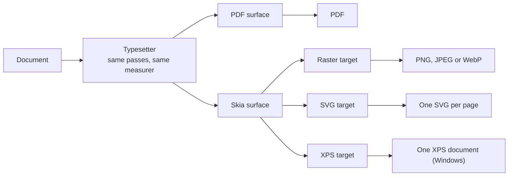
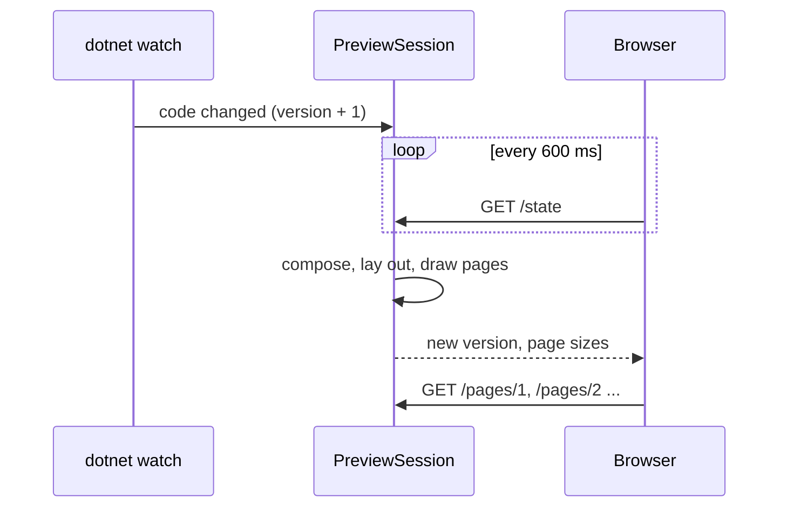

# Page images and preview

The core writes PDF in managed code, with no native dependency. Two optional packages add what needs a
rasteriser: `Rustaveli.Pdf.Raster` draws pages as images, SVG and XPS through SkiaSharp, and recompresses images for
PDF export; `Rustaveli.Pdf.Preview` shows those images in the browser while a document is being written. This page
explains how both work. The guides show how to use them: [Output](../guide/output.md) and
[Preview and debugging](../guide/preview-and-debugging.md).

## One layout, several surfaces

Layout never depends on how its result is drawn ([How layout works](../architecture.md)). The typesetter plans and
renders every page through one drawing seam, and a page image is simply a different surface behind that seam:

An image export measures text with the same shaper, built from the same
[`TypefaceLibrary`](https://themidnightgospel.github.io/Rustaveli.Pdf/api/reference/Rustaveli.Pdf.TypefaceLibrary.html),
as a PDF export does. Lines therefore break at the same words and pages at the same places, and the counting passes
that settle "page 3 of 12" run the same way. Given the same typefaces, a page image shows the PDF's layout, not an
approximation of it.

The Skia surface — the internal `SkiaRasterSurface` — draws onto one of three targets: pixels, an SVG canvas or an
XPS document. The surface does the drawing; the target decides what a page becomes when it ends.

## Text: the same glyphs, not the same string

Skia could shape text itself, but then the image would show Skia's idea of the text rather than the layout's. The
surface never gives Skia a string. It walks the same shaped glyphs the layout measured and the PDF surface writes —
glyph numbers, advances, kerning and offsets — and places each glyph where the layout put it, as a positioned run,
one run per typeface. Each face is loaded into Skia from the very bytes the core parsed, so Skia draws the same font
file, not whatever the system has of the same name.

Glyphs are drawn without hinting, with linear metrics and subpixel positioning, so their outlines sit exactly where
the layout placed them instead of snapping to the pixel grid. A character no typeface has is drawn as the
missing-glyph box, or refused with
[`MissingGlyphException`](https://themidnightgospel.github.io/Rustaveli.Pdf/api/reference/Rustaveli.Pdf.MissingGlyphException.html)
when `RequireEveryGlyph` is on. How glyphs are chosen and shaped is described in [Text](text.md) and
[Fonts](fonts.md).

## Pixels

The size of a page in pixels is its size in points times the resolution over 72, rounded to the nearest pixel, and
at least one. The drawing is then scaled across and down separately so the page fills that grid exactly, as a
viewer rendering the PDF at the same resolution fills it: an A4 page at 96 pixels per inch is 794 pixels wide.
Scaling by the resolution alone would let the rounding drift across the page.

The rest follows the PDF surface as closely as pixels allow:

| | In a page image |
|---|---|
| Background | White for JPEG; transparent for PNG and WebP where no paper is set |
| Colour | Every ink converted to RGB: process colours without a profile, spot inks shown in their fallback ([Colour](colour.md)) |
| Dashes | A pattern of odd length repeated twice over, as PDF repeats it |
| Rounded corners | Fitted to the box as the PDF surface fits them |
| Shadows | Blurred by Skia at the shadow's deviation |
| Gradients | Drawn as a linear gradient between the same inks |
| Images | Decoded as stored and turned upright by their EXIF orientation with the same placement the PDF surface uses; each decoded once per export |
| Images made for their box | Asked for at the page image's own resolution |
| Links, anchors, bookmarks, tags | Left out: an image has nothing to follow or read |

Turning images by their orientation in the surface, rather than letting the decoder do it, keeps the two surfaces in
step: both start from the stored pixels and apply the same turn. An image whose data is cut short is drawn as far as
it goes. The export is at 144 pixels per inch unless told otherwise, and JPEG and WebP at quality 90.

## SVG pages

`ExportSvg` draws each page onto Skia's SVG canvas, one unit to the point. Text is drawn as the outlines of its
glyphs, so the page looks the same on a machine without its fonts; the price is that its text cannot be selected or
searched. Images are carried inside the document as `data:` URIs. Images made for their box are asked for at the
export's `ImageResolution`, 288 pixels per inch unless set. An exported page can be read back by `Artwork.FromSvg`,
at the same size.

## XPS

`ExportXps` writes one XPS document, the fixed-layout format Windows prints through. Skia writes XPS only through
Windows' own XPS support, so elsewhere the export raises `PlatformNotSupportedException`. The result is a ZIP
package with a part for each page; its text stays text, with the fonts it is set in carried in the package.

## Recompressing images for PDF

The core embeds images as they were encoded ([Images](images.md)). Scaling a photograph down to the resolution it
is shown at, or recompressing it at a quality, needs a decoder and an encoder, which the managed core does not have.
So the core asks for an
[`IImageProcessor`](https://themidnightgospel.github.io/Rustaveli.Pdf/api/reference/Rustaveli.Pdf.IImageProcessor.html)
when an image or the export asks for a quality or a maximum resolution, or when PDF/A needs a CMYK image without a
profile made RGB. The Raster package supplies
[`SkiaImageProcessor`](https://themidnightgospel.github.io/Rustaveli.Pdf/api/reference/Rustaveli.Pdf.SkiaImageProcessor.html).

For each image it is given, it decodes the image, turns it upright by its EXIF orientation, scales it to the pixels
asked for with a cubic (Mitchell) filter, and encodes it: as JPEG at the quality asked for, or as PNG where the image
has transparency or no quality was asked. An image with an alpha channel whose pixels are all opaque is still
compressed as JPEG. An image is never enlarged: a maximum resolution only ever lowers the pixel count. The processor
keeps no state, so the single `SkiaImageProcessor.Instance` serves every export.

## How the rendering is checked

Two surfaces that must agree are tested against each other. For each of the fourteen specimen documents of the
conformance tests, the PDF is rendered by PDFium, a renderer that shares no code with this library, and the same
document is exported as page images through Skia, both at 96 pixels per inch. The test then requires:

- the same number of pages, each the same size in pixels;
- after both are laid over white, at most 0.5% of each page's pixels may differ, a pixel counting as different when
  any of its red, green or blue values is more than 96 apart.

Any two rasterisers smooth edges differently, so a pixel-exact comparison would fail on anti-aliasing alone. A glyph
in the wrong place, an image turned the wrong way or a fill left out changes far more than half a percent of a page,
and fails.

The PDF side is pinned too: every page of every specimen, rendered by PDFium, must match an approved snapshot
image, with a tighter tolerance — a channel may be 24 apart, and 0.2% of pixels may differ. Other tests check the
page images directly: the resolution and format asked for, fills where layout put them, images upright whatever their
orientation. Embedded images are also rendered by PDFium and compared with Skia's decoding of the original file. See
[How it is tested](../testing.md).

## The preview

`Rustaveli.Pdf.Preview` shows a document in the browser as its code changes. [ADR 0010](../adr/0010-preview-tooling.md)
chose a browser interface and hot reload through `dotnet watch`. It speaks of a `dotnet` tool; what ships is a
package whose
[`DocumentPreview`](https://themidnightgospel.github.io/Rustaveli.Pdf/api/reference/Rustaveli.Pdf.DocumentPreview.html)
the program itself calls, with the same browser interface.

### A small web server

`StartPreview` creates a
[`PreviewSession`](https://themidnightgospel.github.io/Rustaveli.Pdf/api/reference/Rustaveli.Pdf.PreviewSession.html),
which serves on `http://localhost` only, at the port
[`PreviewOptions`](https://themidnightgospel.github.io/Rustaveli.Pdf/api/reference/Rustaveli.Pdf.PreviewOptions.html)
gives or at a free one. It listens on a background thread of its own and answers each request on the thread pool:

| Address | Answer |
|---|---|
| `/` | The preview page: HTML, CSS and script in one |
| `/state` | The version, each page's size on screen, and any failure |
| `/pages/N` | Page N as PNG |
| `/frames/N` | The frames drawn on page N, as nested JSON |

Nothing is cached by the browser. `Preview` starts a session, opens the browser unless told not to, and waits for
Ctrl+C.

### Drawing when the browser looks

A session counts versions. `Refresh` — or a hot reload — only moves the count on; nothing is drawn yet. The next time
the browser asks, the session sees the count has moved, calls the compose function, and exports the document as page
images at the preview's resolution, recording its frames as it goes. A burst of saves therefore costs one drawing.

The page asks for `/state` every 600 milliseconds. When the version it gets differs from the one it shows, it loads
the pages again, with the version in each address so no old image is reused. Pages are shown at 96 CSS pixels to the
inch, whatever resolution they were drawn at, so a page appears at its nominal size unless the window is too narrow
for it.

### Hot reload

Under `dotnet watch`, the .NET runtime applies code changes to the running program and then tells every type named
by a `MetadataUpdateHandler` attribute. The preview package names one; when told, it moves on the version of every
open session. Sessions are held by weak references and removed when disposed, so a forgotten session does not live
on. On `netstandard2.0`, which does not declare the attribute, the package declares it itself: the runtime finds it
by name.

This is why `Preview` takes a function returning a document rather than a document. A document already composed
holds the frames the old code built; only calling the composing code again, after the update, builds what the new
code says.

### Failures on the page

Whatever the compose function or the layout throws is caught. The session keeps no pages, and the browser lays the
failure over them: the type and message of the exception and of each inner one, and the status reads "Cannot be
set". The next change that fixes the code brings the pages back.

For content that cannot be set, the message traces the way down to it. When layout fails with
[`OversetException`](https://themidnightgospel.github.io/Rustaveli.Pdf/api/reference/Rustaveli.Pdf.OversetException.html),
the typesetter measures the failing part again with tracing switched on, recording each measurement within the one
that asked for it. Measuring changes nothing, so doing it twice is safe, and the trace costs nothing when layout
succeeds. The trace lists each frame from the page down with the room it was offered, and the last says why it could
not fit; the guide shows [an example](../guide/preview-and-debugging.md#reading-a-layout-failure).

### The inspector

While the preview draws its pages, every frame rendered is recorded, each within the frame that drew it: its name,
its top left on the page in points, and the room it was given. Frames are named by what they are — `Stack`, `Inset`,
`Text` — or by the name `Named` gave them, in quotation marks. The browser fetches a page's frames only when the
inspector needs them.

Moving the pointer over a page finds the innermost frame under it, searching the frames drawn last first, and
outlines it. Clicking selects it, opens its place in the tree, and shows where it lies and its size.

Each frame also knows the line of code that made it. While the preview calls the compose function — and only then —
each element made records the first place on the call stack outside this library's own assemblies and .NET's that
has a file name. That is the line in the document's code, and the inspector links to it with a `vscode://file/`
address, which opens it in Visual Studio Code. Reading the stack is slow, so an ordinary export never does it.

A file name and line are known only where the calling code was built with its symbols, as it is by default. Code
built without them, such as a helper package, is passed over to the code that called it. Elements made outside the
compose function record no line.

## ShowFrameEdges and Named

Both are frame modifiers in the core
([`FrameModifiers`](https://themidnightgospel.github.io/Rustaveli.Pdf/api/reference/Rustaveli.Pdf.FrameModifiers.html)),
so they work in every export, not only in the preview.

`ShowFrameEdges` draws its content, then the edges of the room the frame was given: a dashed outline half a point
wide, three points on and two off, in the ink given or a strong red. A label, if given, sits in the top corner in
6-point white type on a tab of the same ink. It is real content, drawn into the PDF as into the image, so it is a
tool for finding where frames lie, to be removed before a document is shipped.

`Named` draws nothing. It gives a frame a name, which the inspector shows and a layout failure uses, so that a trace
reads `"Totals"` rather than one more `Stack` among many.
