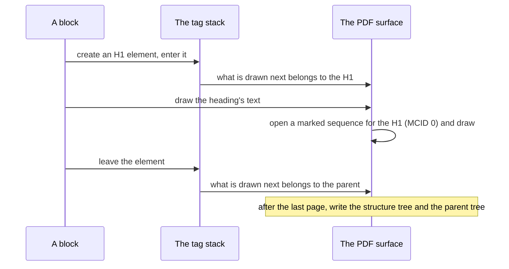

# Standards

Beyond plain PDF 1.7, the library writes files to two families of ISO standards: **PDF/A** (ISO 19005), for
documents kept for the long term, in parts 2 and 3; and **PDF/UA-1** (ISO 14289-1), for documents everyone can read,
assistive technology included. Both rest on **tagged PDF**, which records a document's structure. This page explains
what each standard asks, what the library does to meet it, and how that is checked. How to ask for them is in the
guide, [Output](../guide/output.md#pdfa).

## PDF/A

A PDF/A file must be understood the same way decades from now, by software that does not exist yet, without anything
outside the file. So everything a page needs is inside it — fonts, colour definitions, metadata — and features that
depend on the outside world or hide the content, such as encryption, are forbidden.

[`PdfAConformance`](https://themidnightgospel.github.io/Rustaveli.Pdf/api/reference/Rustaveli.Pdf.PdfAConformance.html)
names a part and a level:

| Level | Requires | Parts |
|---|---|---|
| **B**, basic | The pages look the same wherever they are shown | `PdfA2B`, `PdfA3B` |
| **U**, Unicode | As B, and every glyph's text can be read back | `PdfA2U`, `PdfA3U` |
| **A**, accessible | As U, and the document's structure is recorded | `PdfA2A`, `PdfA3A` |

Part 3 is part 2 with one difference: files of any kind may be attached. That is what electronic invoices such as
ZUGFeRD and Factur-X need, whose machine-readable XML travels inside a PDF/A-3 document; attaching is done with
[`PdfFile`](https://themidnightgospel.github.io/Rustaveli.Pdf/api/reference/Rustaveli.Pdf.PdfFile.html), as the guide
to [existing files](../guide/existing-files.md#attachments-and-electronic-invoices) shows, and the file stays PDF/A-3.

### What every level gets

**Embedded fonts.** PDF/A requires every font to be embedded. The library embeds every font it uses in every
export, subset to the glyphs the document uses (see [Fonts](fonts.md)), so there is nothing extra to do here — but
PDF/A also forbids showing the missing glyph, the box a font draws for a character it lacks. Under PDF/A every
character must therefore be found in some typeface, as if `RequireEveryGlyph` were set; a document with characters no
typeface has fails with `MissingGlyphException`, naming them all.

**An output intent.** Device colours — plain RGB, CMYK and grey — mean different things on different devices, and
PDF/A allows them only when the file says which device they are meant for. The library declares sRGB as the file's
output intent, with an ICC profile of sRGB that it builds itself rather than ships: its white point, its primaries
adapted to D50, and the sRGB transfer curve as a table of 1024 points. Every ink is then written in RGB, so that the
profile describes exactly the colours the file uses. [Colour](colour.md#colour-in-pdfa) lists what that changes:
CMYK and spot inks become RGB, and a CMYK image with no profile of its own is converted to RGB by the export's
`ImageProcessor` — without one, the export fails with an `InvalidOperationException` saying so.

**XMP metadata.** PDF/A requires a document's metadata as XMP, an XML packet in the file, agreeing with the older
information dictionary. The library writes one that says what the information dictionary says — title,
author, subject, keywords, creator, producer, and the creation and modification dates — and claims the part and level
(`pdfaid:part`, `pdfaid:conformance`). The packet is left uncompressed, so tools that scan a file for it without
parsing the PDF find it.

**The restrictions, enforced.** Where PDF/A forbids something the library would otherwise write, it leaves it out or
refuses:

| PDF/A forbids | The library |
|---|---|
| Encryption | Refuses `Protection` with PDF/A: the export fails with an `InvalidOperationException` |
| The missing glyph | Requires every character to be found |
| Device colours other than the output intent's | Writes every ink, gradient and shadow in RGB |
| Asking a viewer to smooth an image (`/Interpolate`) | Draws blurred shadows unsmoothed; images are never smoothed in any export |
| Annotations that do not print | Marks every link annotation to print with the page, in every export |

Transparency is allowed in parts 2 and 3, unlike part 1, so opacity is written as it is in any PDF.

### The U and A levels

Level U asks that every glyph map to the text it shows, so text can be searched, copied and read aloud. The library
writes such a map — a `ToUnicode` CMap — for every font in every export, recording for each glyph the character it
was first used for. Level U therefore costs nothing over level B.

Level A asks for the document's structure, and turns tagging on as `Tagged` does; the next section describes it.
Heading levels, figure descriptions and the like are still the author's to get right.

## Tagged PDF

A PDF page is a stream of drawing operations: glyphs at positions, paths, images. Nothing in it says that these glyphs
are a heading, those a table cell, and that image a chart showing rising revenue. A *tagged* PDF adds a *structure
tree*: elements such as `H1`, `P`, `L`, `Table` and `Figure`, nested as the content nests, in reading order, each
pointing at the stretches of page content drawn for it. Screen readers read the tree; reflow and search use it too.
Content that is not part of the document's meaning — running heads and feet, decorative rules — is marked as an
*artifact* and left out of the tree.

### Recorded as content is drawn

The structure is built while the final pass draws the pages, not from the composed document
([ADR 0018](../adr/0018-tagged-structure.md)). Content crosses pages, is drawn out of order under a draw order,
repeats in running heads and table header rows, and is laid out more than once while the page count settles; only
the drawing knows which content ended up where.

Blocks enter and leave elements on a stack carried through the render, and the surface is told, before each
drawing, which element it belongs to — or none, for an artifact. A block creates its element the first time it draws
and keeps it, so a paragraph that goes on to the next page stays one paragraph, its later parts pointing at content
on the other page. The passes that only count pages, and exports that are not tagged, create nothing, so tagging
costs nothing when it is off.

The surface marks content lazily. A drawing opens a marked sequence (`BDC` … `EMC`) only if the one already open
belongs to a different element, so consecutive runs of one paragraph share a sequence. A sequence is closed before any
graphics state is saved or restored, so sequences always nest properly within the content stream's `q` and `Q`.

When every page is drawn, the tree is written: each element with its role, its parent, its content and, where it
has them, its alternative text and language, followed by the *parent tree* that leads back from each piece of
content to its element. Elements that came to hold nothing — a table body whose rows were all repeats, say — are
left out, so no reader meets an empty element. The catalog is marked as tagged, and each page asks for its links to
be visited in structure order.

### What is tagged, and how

| Content | Tagged as |
|---|---|
| Text inside nothing else that holds text | A paragraph, `P` |
| A list | `L`, with `LI` items, each a label `Lbl` and a body `LBody` |
| A table inside a `ContentTag.Table` | `Table`, with `THead`, `TBody` and `TFoot`, rows `TR` and cells `TD` |
| A header row's cells | `TH`, heading their columns |
| A cell marked with `RowHeading()` | `TH`, heading its row |
| A cell spanning rows or columns | Its cell, with `RowSpan` and `ColSpan` attributes |
| Header and footer rows repeated on later pages | Artifacts: they are read once, where they first appear |
| A link | `Link`, holding the link annotation, described by its address or destination |
| Content in another language | Its element carries `/Lang`; inside a paragraph, a `Span` in that language |
| Paper, underlay, running head and foot, overlay | Artifacts |
| Images and drawings outside a figure or formula | Artifacts |
| Everything inside a figure or formula | That `Figure` or `Formula`, read as its alternative text |

Tables are tagged only inside a table tag, because tables are also used for layout, and a layout grid read as a data
table would mislead. The rest —
[`ContentTag`](https://themidnightgospel.github.io/Rustaveli.Pdf/api/reference/Rustaveli.Pdf.ContentTag.html)'s
headings from `H1` to `H6`, sections, articles, block quotes, captions, notes, code, abbreviations with their
expansion, and the like — is the author's to give with `Tagged`, and `Untagged` leaves content out as decoration.
A figure or formula cannot be made without alternative text: the constructors refuse an empty one.

The reading order is the order content is composed in. A draw order ([ADR 0017](../adr/0017-draw-order.md)) changes
what lies on top, not what is read first.

## PDF/UA

PDF/UA-1 is the standard for accessible PDF. Asking for it with
[`PdfUAConformance.PdfUA1`](https://themidnightgospel.github.io/Rustaveli.Pdf/api/reference/Rustaveli.Pdf.PdfUAConformance.html)
turns tagging on and adds what the standard asks of the file as a whole:

- **A title and a language.** A screen reader announces a document by its title and reads it in its language, so
  the export fails with an `InvalidOperationException` unless the document's `Info` has both. The language goes into
  the catalog as `/Lang`, and the viewer is asked to show the title rather than the file name.
- **Every glyph found**, as under PDF/A, since a missing-glyph box has no text to read.
- **The claim in XMP**, as `pdfuaid:part`. PDF/A admits only the metadata schemas it defines, and those a file
  describes itself; when a document claims both PDF/A and PDF/UA, the library adds the description of PDF/UA's schema
  that PDF/A requires.

What a validator cannot judge remains the author's: headings in order without skipped levels, alternative text
that says what a figure shows, header rows on data tables, and decoration marked as such.

## How conformance is checked

Claims are only worth what checks them. The conformance tests (see [How it's tested](../testing.md)) use two
independent tools:

- **[veraPDF](https://verapdf.org)**, the reference validator for PDF/A and PDF/UA, checks each file against every
  part and level its metadata claims, rule by rule. Every specimen document is exported as PDF/A-2b, PDF/A-3u,
  PDF/A-2a with PDF/UA-1, and PDF/UA-1 alone, together with a specimen that exercises all of tagging — headings, a
  link, a figure, decoration, a list, a table running over pages with repeated header rows and row headings, a change
  of language — under a running head and foot. Every file must pass with no rule broken. Two more checks follow a
  file through [`PdfFile`](existing-files.md): every specimen as PDF/A-2a with PDF/UA-1, saved again unchanged, must
  still pass; and a PDF/A-3b file with a Factur-X invoice attached must stay PDF/A-3.
- **[qpdf](https://qpdf.readthedocs.io)** checks the structure of the file itself — syntax, cross-references,
  stream encodings — for every specimen, both as plain PDF and as PDF/A-2u.

Integration tests check the pieces one at a time: that each of the six PDF/A levels claims its part
and level, that the metadata says what the information dictionary says, that every ink is written in RGB, that a
CMYK image without a profile becomes RGB and needs a processor to do so, that the accessible levels are tagged, that
PDF/UA refuses a document without a title or language, and that shadows are smoothed everywhere except under PDF/A.
