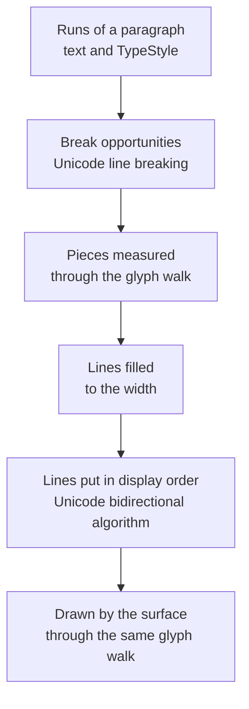

# The text engine

This page explains what happens between a call to `Text(...)` and the glyphs on the page: how a run's typeface is
found, how characters become glyphs, where lines may break, how text in two directions is put in order, and how a
paragraph is set. The [text guide](../guide/text.md) shows how to use these features; [fonts](fonts.md) covers how
font files are read, matched and embedded.

## Shaped in one place

Layout measures text long before anything is drawn. If measuring and drawing had separate opinions about which face
sets a character, which glyph it becomes or how wide it is, a glyph would land in one place and its space be reserved
in another.

So text is shaped in one place ([ADR 0014](../adr/0014-text-is-shaped-once.md)). An internal `TypeShaper` turns text
in a `TypeStyle` into a `GlyphWalk`: a sequence of glyphs, each carrying the face it comes from, the characters it
stands for, its advance, and its kerning against the glyph before it. The walk is the only way text is measured,
fitted or drawn:

- measuring sums each glyph's kerning, the style's tracking, its advance and any word spacing;
- fitting a word into a narrow line stops the same sum early, so a prefix it accepts measures within the width;
- the PDF surface shows the walk's glyphs, with kerning as adjustments in the text and tracking as character spacing,
  and the page-image surface places the same glyphs at the same positions.

A paragraph is walked many times, in every plan and on every pass, but always by the same code with the same inputs,
so the PDF, a page image and the layout agree glyph for glyph.

## Choosing a face

### A run's typeface

A [`TypeStyle`](https://themidnightgospel.github.io/Rustaveli.Pdf/api/reference/Rustaveli.Pdf.TypeStyle.html) names a
typeface, a weight and whether it is italic. The shaper resolves that to one face, trying in turn:

1. the face of that name, registered with the
   [`TypefaceLibrary`](https://themidnightgospel.github.io/Rustaveli.Pdf/api/reference/Rustaveli.Pdf.TypefaceLibrary.html)
   or installed on the machine, nearest the style's weight and slant — a registered typeface shadows an installed one
   of the same name;
2. the typeface the package carries, Noto Sans, when that is the name asked for;
3. a common substitute of the same kind, as a desktop publishing application would substitute a missing font: a
   monospaced name such as Courier from Courier New, Liberation Mono and the like, a serif name such as Times from
   Times New Roman, Liberation Serif and the like, and anything else from Helvetica, Arial, Liberation Sans and the
   like;
4. any registered face;
5. the bundled Noto Sans face nearest the style.

Only faces with TrueType or CFF outlines, which a PDF can embed, are considered, and each answer is remembered.
Because the last step always succeeds, a typeface nobody has does not stop a document: its text comes out in a
substitute.

### Fallback, character by character

A face rarely has every character. As the walk reads each character, it asks whether the run's face has a glyph for
it; if not, the character is set in the first face that has one:

1. a face already found as a fallback for this style, so that a run of CJK text finds its face once rather than once
   per character;
2. the style's own fallback typefaces, named after the typeface in `WithTypeface("Noto Sans", "Noto Sans Symbols")`;
3. the library's `Fallbacks`;
4. the registered faces, nearest the style first;
5. the installed faces;
6. the faces the package carries.

A character found nowhere is set in the run's own face as its missing-glyph box, and remembered. With
`RequireEveryGlyph` on in
[`PdfExportOptions`](https://themidnightgospel.github.io/Rustaveli.Pdf/api/reference/Rustaveli.Pdf.PdfExportOptions.html),
and always under PDF/A and PDF/UA, export then fails with a
[`MissingGlyphException`](https://themidnightgospel.github.io/Rustaveli.Pdf/api/reference/Rustaveli.Pdf.MissingGlyphException.html)
naming every such character instead. Characters that draw nothing, such as controls, are never counted as missing.

## Substitutions and kerning

Consecutive characters set in the same face form a run, and a run is shaped as a whole, since a ligature joins
neighbours. The shaper applies the face's `GSUB` substitutions to the run, then walks the result a glyph at a time.

### Substitutions

A font keeps its features per script, so the shaper first looks at the run's first character that belongs to a
script it recognises by Unicode block — Latin, Greek, Cyrillic, Armenian, Hebrew, Arabic or Georgian — and uses the
font's features for that script, falling back to the font's default script and then to Latin. Digits, spaces and
punctuation belong to no script and go with the text around them. The script's default language system is used.

These features are on for every face, as a shaper turns them on for scripts without shaping rules of their own:

| Tag | Feature |
|---|---|
| `rvrn` | Required variation alternates |
| `ccmp` | Glyph composition and decomposition |
| `locl` | Localised forms |
| `rlig` | Required ligatures |
| `calt` | Contextual alternates |
| `clig` | Contextual ligatures |
| `liga` | Standard ligatures |

A style can turn features on or off beyond these: `Ligatures(false)` turns off `liga` and `clig`, `SmallCapitals()`,
`OldstyleFigures()` and `TabularFigures()` turn on `smcp`, `onum` and `tnum`, and `WithFeature(tag, value)` sets any
feature, a value above 1 choosing among a feature's alternates. A feature the face does not have does nothing.

The lookups of every feature that applies then run over the whole run in the order the font lists them, which is the
order it was designed for. All eight lookup types are applied, and the lookup flags that skip bases, ligatures or
marks are honoured using the font's `GDEF` table; feature variations of variable fonts are not read. A face whose
substitutions cannot be read is set without them, since its text still reads.

A ligature such as "ffi" carries all its characters, so the text can still be searched and copied from the PDF.

### Kerning, tracking and word spacing

Pair kerning comes from the `kern` feature's pair adjustments in the font's `GPOS` table, merged across the scripts
the font lists, or from the older `kern` table when there is no `GPOS` kerning. It is applied between neighbouring
glyphs of the same face; glyphs from different faces, such as a character set in a fallback, are not kerned against
each other.

Tracking adds space between characters — N characters have N − 1 gaps, so centred text stays centred — and word
spacing widens each space and no-break space.

## Line breaking

Where a line may end is decided by the Unicode line breaking algorithm, UAX #14, with the default rules of
Unicode 16.0, checked against every case of the conformance file Unicode publishes. Those rules break after spaces
and hyphens, between ideographs in Chinese and Japanese text, and never before closing punctuation, among much else.
Thai, Lao, Khmer and Myanmar, which need a dictionary to find words, break only at spaces and punctuation.

The text is cut at every break opportunity, and each piece into up to three tokens: the word, the breakable
whitespace after it, and a line ending if the break is mandatory. Lines are filled token by token:

- A word that fits goes on the line. One that does not starts a new line.
- Whitespace that does not fit ends the line and is dropped. Whitespace at the end of any line is trimmed, so it does
  not push centred or right-aligned text off true or widen a table column — unless it carries a link.
- No-break spaces, narrow no-break spaces and figure spaces are part of the word, not places to break, so "10 000" and
  "Fig. 4" stay together.
- A mandatory break — a line feed, a carriage return (with a line feed after it, one break), a vertical tab, a form
  feed, a next-line character, or a line or paragraph separator — ends the line, and the text after it opens a new
  paragraph.
- A word too long for a line of its own is broken between characters, filling each line. The break falls before the
  first glyph that would overflow, so a ligature is never cut in two, and each line takes at least one character, so
  even an impossibly narrow column ends.
- Type set with `BreakAnywhere()` is broken the same way wherever it reaches the end of a line, rather than moving to
  a new line first: long identifiers and URLs fill each line.
- A frame set inline among the words is one unbreakable token. If it cannot fit on a line of its own, the whole
  paragraph defers, since a frame cannot be split across lines.

Words are not hyphenated.

## Bidirectional text

Text that mixes left-to-right and right-to-left scripts is ordered by the Unicode bidirectional algorithm, UAX #9,
with the character data of Unicode 16.0, checked against every case of both conformance files Unicode publishes for
it.

**The paragraph level** comes from the reading direction in force — the section's `ReadingDirection`, or a frame's
`RightToLeft()` or `LeftToRight()` — not from the first letter of the text. A right-to-left document stays right to
left even where a paragraph begins with a Latin word.

**Levels are resolved once per paragraph**, before lines are broken, because a character's direction can depend on
text several lines away. A paragraph here is the text between mandatory breaks.

**A run with a direction of its own** — `RightToLeft()` or `LeftToRight()` on a run — is enclosed in isolate controls,
so it is resolved as one unit: a Hebrew name in an English sentence keeps its own word order and takes its punctuation
with it. The controls are never drawn. A frame set inline stands in the paragraph's text as an object replacement
character, a neutral that takes the direction of the text around it.

**Lines are broken in logical order**, on the widths of the text as stored. Then each line is reordered on its own:
white space at the end of the line goes back to the paragraph's direction, and runs at right-to-left levels are
reversed. Each run is split where the level changes, and the right-to-left pieces are drawn with their first character
at the right.

**Right-to-left text is shaped in logical order**, since joining and ligatures depend on it, with each character that
has a mirror image — a bracket, say — replaced by that image. Its glyphs are then handed out cluster by cluster, last
first, each cluster kept in its own order so a mark still follows the letter it sits on.

**Most text never pays for any of this.** A paragraph not set right to left, with no right-to-left character,
Arabic number or directional control, is recognised by a quick scan and drawn as stored.

## Setting a paragraph

### Line height and alignment

A line is as tall as the tallest of its runs' line heights: the font's ascent, descent and line gap, times the style's
leading. It is never shorter than its tallest ascent plus its deepest descent, which superscripts, subscripts and
inline frames can extend. A blank line takes the height of the paragraph's own type.

Lines sit against the start edge unless told otherwise — the left in left-to-right text, the right in right-to-left
text — and `FlushStart()` and `FlushEnd()` follow the direction in the same way. `FlushLeft()`, `Centered()` and
`FlushRight()` are absolute.

### Justification

A justified line is spread to the full width by widening the spaces between its words, each space by the same amount.
Spaces before the first word or after the last are left as typed, and the letters themselves are never spaced out. The
last line of each paragraph, and a line with no space between words, is not spread; it sits against the start edge.

### Indents and paragraph spacing

`FirstLineIndent` indents the opening line of each paragraph, on the edge lines start from. It applies only when the
lines sit against that edge — flush to the start or justified — because an indent that is never drawn should not cost
the line its width. `SpaceBetweenParagraphs` adds space before every paragraph but the first, except at the top of a
page and before a blank line.

### Line limits

`MaxLines(count, ellipsis)` stops the paragraph after that many lines; text past the limit is not even measured. The
last line is cut back until the ellipsis fits after it — whole words first, then characters, never leaving a space
before it — and the ellipsis is set in the paragraph's own type. In a right-to-left paragraph it ends the line at the
left.

### Paragraphs across pages

A paragraph splits between lines: it sets as many whole lines as fit in the room left, answers `Partial`, and
continues on the next page ([how layout works](layout.md#the-fitting-contract)). If not even one line fits, it defers.

Lines depend only on the text, the width, the type and the direction, so a paragraph builds them once and reuses them
across every plan and pass — unless its text depends on the page, such as a page number, or it holds an inline frame.
Once a paragraph has drawn its first lines, its wrapping is frozen: continuation pages set exactly the lines that were
built, rather than wrapping again from inline frames whose own progress drawing has just advanced.

## Complex scripts

Some scripts need rules of their own: Arabic letters join and change shape with their neighbours, Indic vowel signs
are reordered around their consonants, and marks are placed on their letters. That is a large, script-specific body
of logic HarfBuzz has refined for years, so the core carries only the Unicode algorithms and the font features that
need no script-specific logic, and complex shaping comes from the optional `Rustaveli.Pdf.Shaping` package — the only
part of the text engine with a native dependency ([ADR 0015](../adr/0015-text-engine-layers.md)).

[`ShapeComplexScripts()`](https://themidnightgospel.github.io/Rustaveli.Pdf/api/reference/Rustaveli.Pdf.ComplexScripts.html)
installs a HarfBuzz shaper on a `TypefaceLibrary`. From then on, a run set in one face that holds any character of
Hebrew, Arabic and its neighbouring scripts, the scripts of India from Devanagari to Sinhala, or Thai, Lao, Tibetan,
Myanmar, Khmer and other scripts of South-East Asia, is handed to HarfBuzz whole. HarfBuzz shapes it from the face's
own tables, with the style's feature settings on top of its own defaults, and returns the glyphs with their advances
(kerning included) and offsets. The walk hands those glyphs out like any others, and the PDF surface draws each displaced glyph — a mark on its letter — at exactly the position
HarfBuzz gave it. Every other run is shaped by the core as before.

Without the package, such text is still set, a glyph for each character through the core's substitutions: Arabic
letters in their isolated forms, Indic vowel signs where they were typed, marks unplaced. Bidirectional ordering does
not depend on the package, so Hebrew without points and the order of mixed-direction text are right either way. See
[known limitations](../limitations.md).
